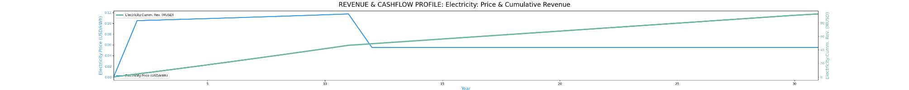

GEOPHIRES Investment and Production Tax Credit implementation (as in the USA Inflation Reduction ACT (IRA))

Introduction

A popular method for Governments to encourage economic development is to offer tax incentives, like the Investment Tax Credit[^1] (ITC) or the Production Tax Credit[^2] (PTC). This type of encouragement is popular with governments because they offer a way to incentivize activities in a budget-neutral or budget-positive way – if the project is not done, the incentives are not awarded, and there is no impact on the budget; if the incentives are awarded, it is for projects that produce a taxable profit, of which the government will give up part of its tax revenue, but not all, this increasing the income of the government. They also offer new tax revenues for product purchases, new employment, and other income streams (and non-monetary benefits) that are desirable.

[^1]: https://content.next.westlaw.com/practical-law/document/I03f4d8caeee311e28578f7ccc38dcbee/Investment-Tax-Credit-ITC

[^2]: https://content.next.westlaw.com/practical-law/document/I03f4d8cceee311e28578f7ccc38dcbee/Production-Tax-Credit-PTC

An example of a PTC and ITC is in the USA Inflation Reduction Act (IRA) of 2022[^3]. The details of the IRA are beyond the scope of this document, but the summary is this: the IRA offers up to a 60% ITC or a 4.5 cent/kWh PTC. In the case of an ITC, a “60% ITC” means that up to 60% of the investment in a project be written down against the investor's tax liability for the year the ITC was awarded. If the entity receiving the ITC award is a non-taxable entity, the tax liability write-off can be sold in an exchange to any company that has a liability. In the case of a PTC, the US government will award a tax write-off equivalent to 4.5 cents/kWh of electricity produced.

[^3]: https://vitalsigns.edf.org/story/inflation-reduction-act-victory-climate-heres-what-comes-next

This document explains how the ITC and PTC are incorporated in GEOPHIRES-X. It is implemented in a generic way that works for any ITC and/or PTC for which the project qualifies (IRA or otherwise)—the examples herein will use the IRA for illustrative purposes. Note that PTCs and/or ITCs may be cumulative – an award of a PTC from the federal level may be added to a state-level PTC, for example. In that case, sum the PTCs and/or ITCs values when you use them in GEOPHIRES-X. Also note that the IRA offer only an ITC OR a PTC, not both.

Implementing an ITC in GEOPHIRES

An ITC is implemented in GEOPHIRES-X through the BICYCLE Economic model. It will not be calculated for any other economic model. One additional parameter is added:

Investment Tax Credit Rate,0.5, --- [-] Investment tax credit rate

In this case, the ITC is set to 50%. It could represent an ITC from the IRA or the sum of several ITCs from several taxation entities.

After GEOPHIRES makes its Capital Expenditure[^4] (CAPEX) calculations, it will subtract the value of the ITC credit from CAPEX and will report it as follows:

[^4]: https://www.investopedia.com/terms/c/capitalexpenditure.asp

**\*\*\*CAPITAL COSTS (M\$)\*\*\***

**Drilling and completion costs: 21.95 MUSD**

**Drilling and completion costs per well: 5.49 MUSD**

**Stimulation costs: 0.00 MUSD**

**Surface power plant costs: 20.78 MUSD**

**Field gathering system costs: 2.32 MUSD**

**Total surface equipment costs: 23.10 MUSD**

**Exploration costs: 5.33 MUSD**

**Investment Tax Credit: -25.18 MUSD**

**Total capital costs: 25.18 MUSD**

Note that the ITC and the total capital costs are equal because the ITC is 50% of the total capital cost. Without the ITC, the project CAPEX was 50.36 MMUSD.

Reducing the CAPEX has many other economic modeling impacts. For example:

Electricity breakeven price: 5.31 cents/kWh (without ITC: 13.24 cents/kWh)

Project NPV: -12.81 MUSD (without ITC: -37.99 MUSD)

Project IRR: 0.61% (without ITC: -3.53%)

Project VIR=PI=PIR: 0.49 (without ITC: 0.25)

Project MOIC: 0.04 (without ITC: -0.25)

Project Payback Period: 28.00 yrs (without ITC: never)

Implementing a PTC in GEOPHIRES

A PTC is also implemented in GEOPHIRES-X through only the BICYCLE Economic model. Several additional parameters have been added:

Production Tax Credit Electricity, 0.05, ---\$/kWh

Production Tax Credit Heat, 0.05, ---\$/kWh

Production Tax Credit Cooling, 0.05, ---\$/kWh

Production Tax Credit Duration, 10, ---in years

Production Tax Credit Inflation Adjusted, True, --- (T/F)

PTC differs from ITC in that it can be applied differently (or not at all) to different products (electricity vs. heat vs. cooling). In the case of the ITC, the PTC applies only to electricity – no incentives for heating or cooling. This example grants 5 cents/kWh for electricity (and the same for heating and cooling, but the model that is running for electricity only, so the only thing that gets the PTC is the electricity output). In the case of the PTC, the time period is limited to 10 years from the time of the start of the project, so GEOPHIRES-X implements a parameter to control that duration (“Production Tax Credit Duration”). Another feature of the PTC in the IRA is that the PTC amount can be indexed to inflation, controlled by the Boolean parameter “Production Tax Credit Inflation Adjusted”).

GEOPHIRES-X accounts for the value of the PTC by automatically adding it to the annual electricity price for the duration of the PTC. In the output, that looks like this (note that the base price for electricity in this example is 5.5 cents/kWh):

Year Electricity \| Heat \| Cooling \| Carbon \| Project

Since Price Ann. Rev. Cumm. Rev. \| Price Ann. Rev. Cumm. Rev. \| Price Ann. Rev. Cumm. Rev.

Start (cents/kWh)(MUSD/yr) (MUSD) \|(cents/kWh) (MUSD/yr) (MUSD) \|(cents/kWh) (MUSD/yr) (MUSD)

\_______________________________________________________________________________________________________________________\_

1 0.00 -50.37 0.00 \| 0.00 0.00 0.00 \| 0.00 0.00 0.00

2 10.50 2.95 4.35 \| 7.50 0.00 0.00 \| 7.50 0.00 0.00

3 10.62 3.05 8.79 \| 7.62 0.00 0.00 \| 7.62 0.00 0.00

4 10.75 3.12 13.31 \| 7.75 0.00 0.00 \| 7.75 0.00 0.00

5 10.88 3.19 17.89 \| 7.88 0.00 0.00 \| 7.88 0.00 0.00

6 11.02 3.25 22.54 \| 8.02 0.00 0.00 \| 8.02 0.00 0.00

7 11.16 3.31 27.25 \| 8.16 0.00 0.00 \| 8.16 0.00 0.00

8 11.30 3.38 32.02 \| 8.30 0.00 0.00 \| 8.30 0.00 0.00

9 11.44 3.44 36.86 \| 8.44 0.00 0.00 \| 8.44 0.00 0.00

10 11.59 3.51 41.77 \| 8.59 0.00 0.00 \| 8.59 0.00 0.00

11 11.74 3.58 46.74 \| 8.74 0.00 0.00 \| 8.74 0.00 0.00

12 5.50 0.93 49.07 \| 2.50 0.00 0.00 \| 2.50 0.00 0.00

13 5.50 0.94 51.40 \| 2.50 0.00 0.00 \| 2.50 0.00 0.00

In this case, Year 1 is a construction year; Year 2 is the first year of the PTC (so the price is 5.5 cents (base price) plus 5 cents (PTC ); and the subsidy rises by the inflation specified in the BICYCLE model (in this case, 2%) for 10 years (through year 11) when the subsidy terminates, and the price goes back to 5.5 cents/kWh.

Increasing the effective electricity price by the PTC has many other economic modeling impacts. For example:

Project NPV: -21.06 MUSD (without ITC: -37.99 MUSD, ITC: 12.81 MUSD)

Project IRR: 0.15% (without ITC: -3.53%, ITC: 0.61%)

Project VIR=PI=PIR: 0.58 (without ITC: 0.25, ITC: 0.49)

Project MOIC: 0.01 (without ITC: -0.25, ITC: 0.04)

Project Payback Period: 29.69 yrs (without ITC: never, ITC: 28 years)

The conclusion that can be drawn from this is that for this scenario, accepting the 50% ITC will produce a slightly better financial result than accepting a 5 cent/kWh (inflation-adjusted) PTC. Different scenarios will yield different results.

Visualized graphically, the price and cash flow over the life of the project:

Example[¶](https://nrel.github.io/GEOPHIRES-X/Monte-Carlo-User-Guide.html#documentation)

See Example1_ITC.txt
