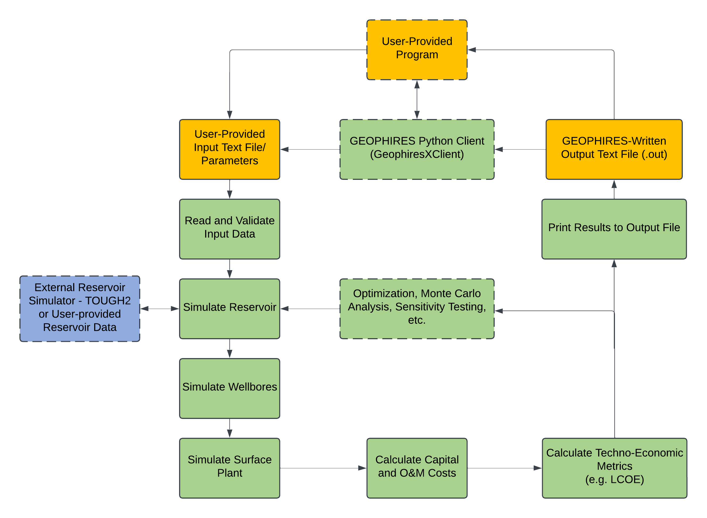

========
Overview
========

|GEOPHIRES Logo|

.. |GEOPHIRES Logo| image:: geophires-logo.png
    :alt: GEOPHIRES Logo

GEOPHIRES is a free and open-source geothermal techno-economic simulator.
GEOPHIRES combines reservoir, wellbore, surface plant, and economic models to estimate the capital and operation and maintenance costs,
instantaneous and lifetime energy production, and overall levelized cost of energy of a geothermal plant.
Various reservoir conditions (EGS, doublets, etc.) and end-use options (electricity, direct-use heat, cogeneration) can be modeled.
Users are encouraged to build upon to the GEOPHIRES framework to implement their own correlations and models.
See the `Documentation`_ section below for more information.

This repository is the canonical source for the modern GEOPHIRES simulator, which succeeds the legacy `GEOPHIRES v2.0 <https://github.com/NREL/GEOPHIRES-v2>`__.
The name GEOPHIRES-X refers to the initial modernized (v3) framework.
See the `CHANGELOG <CHANGELOG.rst>`__ for a detailed history of changes and release notes.

Free software: `MIT license <LICENSE>`__

.. start-badges

.. list-table::
    :stub-columns: 1

    * - tests
      - | |github-actions|
        | |coverage|
    * - package
      - | |commits-since|
        | |code-style|
        | |license|

.. TODO add the following to package badge list once PyPy distribution enabled: |version| |wheel| |supported-versions| |supported-implementations|
..    * - docs
..      - | |docs|

.. |github-actions| image:: https://github.com/NREL/GEOPHIRES-X/actions/workflows/github-actions.yml/badge.svg
    :alt: GitHub Actions Build Status
    :target: https://github.com/NREL/GEOPHIRES-X/actions

.. |version| image:: https://img.shields.io/pypi/v/geophires-x.svg
    :alt: PyPI Package latest release
    :target: https://pypi.org/project/geophires-x

.. |wheel| image:: https://img.shields.io/pypi/wheel/geophires-x.svg
    :alt: PyPI Wheel
    :target: https://pypi.org/project/geophires-x

.. |supported-versions| image:: https://img.shields.io/pypi/pyversions/geophires-x.svg
    :alt: Supported versions
    :target: https://pypi.org/project/geophires-x

.. |supported-implementations| image:: https://img.shields.io/pypi/implementation/geophires-x.svg
    :alt: Supported implementations
    :target: https://pypi.org/project/geophires-x

.. |commits-since| image:: https://img.shields.io/github/commits-since/softwareengineerprogrammer/GEOPHIRES-X/v3.9.55.svg
    :alt: Commits since latest release
    :target: https://github.com/softwareengineerprogrammer/GEOPHIRES-X/compare/v3.9.55...main

.. |docs| image:: https://readthedocs.org/projects/GEOPHIRES-X/badge/?style=flat
    :target: https://nrel.github.io/GEOPHIRES-X
    :alt: Documentation Status

.. |coverage| image:: https://coveralls.io/repos/github/NREL/GEOPHIRES-X/badge.svg?branch=main
    :target: https://coveralls.io/github/NREL/GEOPHIRES-X?branch=main
    :alt: Coverage Status

.. |code-style| image:: https://img.shields.io/badge/code%20style-black-000000.svg
    :target: https://github.com/NREL/GEOPHIRES-X/blob/main/.pre-commit-config.yaml
    :alt: Code Style: black

.. |license| image:: https://img.shields.io/badge/license-MIT-green.svg
    :target: https://github.com/NREL/GEOPHIRES-X/blob/main/LICENSE
    :alt: MIT license

.. end-badges

Getting Started
===============

A web interface is available at `gtp.scientificwebservices.com/geophires <https://gtp.scientificwebservices.com/geophires>`__.

To run GEOPHIRES locally or to modify the source code, see the `Getting Started Guide <INSTALL.rst>`__.

Documentation
=============

GEOPHIRES combines reservoir, wellbore, surface plant, and economic and cost models
and correlations to estimate the capital and operation and maintenance costs,
instantaneous and lifetime energy production, and overall levelized cost of energy of a
geothermal plant.

The high-level software architecture is illustrated in the diagram below. Green, orange and blue rectangles
refer to internal GEOPHIRES components, external user-interface components, and
external reservoir simulators (TOUGH2), respectively. Rectangles with solid outline are
always executed during a simulation run; rectangles with dashed outline refer to optional
or user-provided components.

|GEOPHIRES Architecture Diagram|

GEOPHIRES has a variety of different reservoir models including
(1) Multiple parallel fractures model (Gringarten);
(2) 1-Dimensional linear heat sweep model;
(3) M/A thermal drawdown parameter model;
(4) Percentage temperature drawdown model;
(5) User-provided reservoir temperature production data;
(6) Coupling to TOUGH2 external reservoir simulator;
(7) SUTRA: Reservoir Thermal Energy Storage (RTES; also known as Underground Thermal Energy Storage - UTES);
(8) Slender Body Theory (SBT);
(9) Cylindrical.

GEOPHIRES can simulate three different end-uses of the geothermal heat: (1)
direct-use heat (e.g. for industrial processing heating or residential space heating);
(2) electricity (with subcritical ORC, supercritical ORC, single-flash, or double-flash plant);
(3) co-generation of heat and electricity. The co-generation option considers bottoming
cycle, topping cycle, and parallel cycle.

GEOPHIRES has 5 economic models to calculate the levelized cost of heat or
electricity: (1) fixed charge rate (FCR) model;
(2) standard discounting levelized cost model;
(3) BICYCLE model;
(4) CLGS;
(5) `SAM Single-owner PPA <https://nrel.github.io/GEOPHIRES-X/SAM-Economic-Models.html>`__.

The capital and O&M costs for the different geothermal system components (exploration,
well drilling, surface plant, etc.) are either provided by the user or calculated with built-in
correlations.

For more information on the theoretical basis for GEOPHIRES see
`Theoretical Basis for GEOPHIRES <https://nrel.github.io/GEOPHIRES-X/Theoretical-Basis-for-GEOPHIRES.html>`__
and `GEOPHIRES reference materials <References/README.md#geophires>`__.

Parameters
----------

Available parameters are documented in the `Parameters Reference <https://nrel.github.io/GEOPHIRES-X/parameters.html>`__.

Note that many parameters are interrelated and/or conditionally dependent on one another;
reviewing the GEOPHIRES example(s) relevant to your use case in the following section
is strongly recommended to gain a working understanding of how to construct valid sets of input parameters.

Examples
--------

GEOPHIRES includes a variety of example input files demonstrating its features for different types of geothermal systems
and case studies of real-world geothermal projects.
Starting with an existing GEOPHIRES example that is similar to your intended use/application can be an easier approach to using GEOPHIRES than constructing your own inputs from scratch.

Example input ``.txt`` files and corresponding case report ``.out`` files are available in the `tests/examples directory <tests/examples>`__ of the repository.
Example-specific web interface deeplinks are listed in the Link column.

.. list-table::
   :widths: 50 40 5 5
   :header-rows: 1

   * - Example
     - Input file
     - Case report file
     - Link
   * - Example 1: EGS Electricity
     - `example1.txt <tests/examples/example1.txt>`__
     - `.out <tests/examples/example1.out>`__
     - `link <https://gtp.scientificwebservices.com/geophires?geophires-example-id=example1>`__
   * - Example 1 with Add-Ons
     - `example1_addons.txt <tests/examples/example1_addons.txt>`__
     - `.out <tests/examples/example1_addons.out>`__
     - `link <https://gtp.scientificwebservices.com/geophires?geophires-example-id=example1_addons>`__
   * - Example 2: EGS Direct-Use Heat
     - `example2.txt <tests/examples/example2.txt>`__
     - `.out <tests/examples/example2.out>`__
     - `link <https://gtp.scientificwebservices.com/geophires?geophires-example-id=example2>`__
   * - Example 3: EGS Co-generation
     - `example3.txt <tests/examples/example3.txt>`__
     - `.out <tests/examples/example3.out>`__
     - `link <https://gtp.scientificwebservices.com/geophires?geophires-example-id=example3>`__
   * - Example 4: Hydrothermal Electricity
     - `example4.txt <tests/examples/example4.txt>`__
     - `.out <tests/examples/example4.out>`__
     - `link <https://gtp.scientificwebservices.com/geophires?geophires-example-id=example4>`__
   * - Example 5: User-Provided Reservoir Data
     - `example5.txt <tests/examples/example5.txt>`__
     - `.out <tests/examples/example5.out>`__
     - `link <https://gtp.scientificwebservices.com/geophires?geophires-example-id=example5>`__
   * - Example 6: TOUGH2 (Multiple Gradients)
     - `example6.txt <tests/examples/example6.txt>`__
     - `.out <tests/examples/example6.out>`__
     - \*
   * - Example 7: TOUGH2 (Single Gradient)
     - `example7.txt <tests/examples/example7.txt>`__
     - `.out <tests/examples/example7.out>`__
     - \*
   * - Example 8: Cornell Direct-Use Heat
     - `example8.txt <tests/examples/example8.txt>`__
     - `.out <tests/examples/example8.out>`__
     - `link <https://gtp.scientificwebservices.com/geophires?geophires-example-id=example8>`__
   * - Example 9: Cornell Electricity
     - `example9.txt <tests/examples/example9.txt>`__
     - `.out <tests/examples/example9.out>`__
     - `link <https://gtp.scientificwebservices.com/geophires?geophires-example-id=example9>`__
   * - Example 10: Heat Pump
     - `example10_HP.txt <tests/examples/example10_HP.txt>`__
     - `.out <tests/examples/example10_HP.out>`__
     - `link <https://gtp.scientificwebservices.com/geophires?geophires-example-id=example10_HP>`__
   * - Example 11: Absorption Chiller
     - `example11_AC.txt <tests/examples/example11_AC.txt>`__
     - `.out <tests/examples/example11_AC.out>`__
     - `link <https://gtp.scientificwebservices.com/geophires?geophires-example-id=example11_AC>`__
   * - Example 12: District Heating
     - `example12_DH.txt <tests/examples/example12_DH.txt>`__
     - `.out <tests/examples/example12_DH.out>`__
     - `link <https://gtp.scientificwebservices.com/geophires?geophires-example-id=example12_DH>`__
   * - Example 13: Redrilling due to Drawdown
     - `example13.txt <tests/examples/example13.txt>`__
     - `.out <tests/examples/example13.out>`__
     - `link <https://gtp.scientificwebservices.com/geophires?geophires-example-id=example13>`__
   * - CLGS: Coaxial sCO2: Heat
     - `Beckers_et_al_2023_Tabulated_Database_Coaxial_sCO2_heat.txt <tests/examples/Beckers_et_al_2023_Tabulated_Database_Coaxial_sCO2_heat.txt>`__
     - `.out <tests/examples/Beckers_et_al_2023_Tabulated_Database_Coaxial_sCO2_heat.out>`__
     - `link <https://gtp.scientificwebservices.com/geophires?geophires-example-id=Beckers_et_al_2023_Tabulated_Database_Coaxial_sCO2_heat>`__
   * - CLGS: Coaxial Water: Heat
     - `Beckers_et_al_2023_Tabulated_Database_Coaxial_water_heat.txt <tests/examples/Beckers_et_al_2023_Tabulated_Database_Coaxial_water_heat.txt>`__
     - `.out <tests/examples/Beckers_et_al_2023_Tabulated_Database_Coaxial_water_heat.out>`__
     - `link <https://gtp.scientificwebservices.com/geophires?geophires-example-id=Beckers_et_al_2023_Tabulated_Database_Coaxial_water_heat>`__
   * - CLGS: Uloop sCO2: Electricity
     - `Beckers_et_al_2023_Tabulated_Database_Uloop_sCO2_elec.txt <tests/examples/Beckers_et_al_2023_Tabulated_Database_Uloop_sCO2_elec.txt>`__
     - `.out <tests/examples/Beckers_et_al_2023_Tabulated_Database_Uloop_sCO2_elec.out>`__
     - `link <https://gtp.scientificwebservices.com/geophires?geophires-example-id=Beckers_et_al_2023_Tabulated_Database_Uloop_sCO2_elec>`__
   * - CLGS: Uloop sCO2: Heat
     - `Beckers_et_al_2023_Tabulated_Database_Uloop_sCO2_heat.txt <tests/examples/Beckers_et_al_2023_Tabulated_Database_Uloop_sCO2_heat.txt>`__
     - `.out <tests/examples/Beckers_et_al_2023_Tabulated_Database_Uloop_sCO2_heat.out>`__
     - `link <https://gtp.scientificwebservices.com/geophires?geophires-example-id=Beckers_et_al_2023_Tabulated_Database_Uloop_sCO2_heat>`__
   * - CLGS: Uloop Water: Electricity
     - `Beckers_et_al_2023_Tabulated_Database_Uloop_water_elec.txt <tests/examples/Beckers_et_al_2023_Tabulated_Database_Uloop_water_elec.txt>`__
     - `.out <tests/examples/Beckers_et_al_2023_Tabulated_Database_Uloop_water_elec.out>`__
     - `link <https://gtp.scientificwebservices.com/geophires?geophires-example-id=Beckers_et_al_2023_Tabulated_Database_Uloop_water_elec>`__
   * - CLGS: Uloop Water: Heat
     - `Beckers_et_al_2023_Tabulated_Database_Uloop_water_heat.txt <tests/examples/Beckers_et_al_2023_Tabulated_Database_Uloop_water_heat.txt>`__
     - `.out <tests/examples/Beckers_et_al_2023_Tabulated_Database_Uloop_water_heat.out>`__
     - `link <https://gtp.scientificwebservices.com/geophires?geophires-example-id=Beckers_et_al_2023_Tabulated_Database_Uloop_water_heat>`__
   * - CLGS: SBT High Temperature
     - `example_SBT_Hi_T.txt <tests/examples/example_SBT_Hi_T.txt>`__
     - `.out <tests/examples/example_SBT_Hi_T.out>`__
     - `link <https://gtp.scientificwebservices.com/geophires?geophires-example-id=example_SBT_Hi_T>`__
   * - CLGS: SBT Low Temperature
     - `example_SBT_Lo_T.txt <tests/examples/example_SBT_Lo_T.txt>`__
     - `.out <tests/examples/example_SBT_Lo_T.out>`__
     - `link <https://gtp.scientificwebservices.com/geophires?geophires-example-id=example_SBT_Lo_T>`__
   * - SUTRA Example 1
     - `SUTRAExample1.txt <tests/examples/SUTRAExample1.txt>`__
     - `.out <tests/examples/SUTRAExample1.out>`__
     - `link <https://gtp.scientificwebservices.com/geophires?geophires-example-id=SUTRAExample1>`__
   * - Multiple Gradients
     - `example_multiple_gradients.txt <tests/examples/example_multiple_gradients.txt>`__
     - `.out <tests/examples/example_multiple_gradients.out>`__
     - `link <https://gtp.scientificwebservices.com/geophires?geophires-example-id=example_multiple_gradients>`__
   * - Investment Tax Credit
     - `example_ITC.txt <tests/examples/example_ITC.txt>`__
     - `.out <tests/examples/example_ITC.out>`__
     - `link <https://gtp.scientificwebservices.com/geophires?geophires-example-id=example_ITC>`__
   * - Production Tax Credit
     - `example_PTC.txt <tests/examples/example_PTC.txt>`__
     - `.out <tests/examples/example_PTC.out>`__
     - `link <https://gtp.scientificwebservices.com/geophires?geophires-example-id=example_PTC>`__
   * - Fervo Project Red (2023)
     - `Fervo_Norbeck_Latimer_2023.txt <tests/examples/Fervo_Norbeck_Latimer_2023.txt>`__
     - `.out <tests/examples/Fervo_Norbeck_Latimer_2023.out>`__
     - `link <https://gtp.scientificwebservices.com/geophires?geophires-example-id=Fervo_Norbeck_Latimer_2023>`__
   * - Fervo Cape Station 1: 2023 Results
     - `Fervo_Project_Cape.txt <tests/examples/Fervo_Project_Cape.txt>`__
     - `.out <tests/examples/Fervo_Project_Cape.out>`__
     - `link <https://gtp.scientificwebservices.com/geophires?geophires-example-id=Fervo_Project_Cape>`__
   * - Fervo Cape Station 2: 2024 Results
     - `Fervo_Project_Cape-2.txt <tests/examples/Fervo_Project_Cape-2.txt>`__
     - `.out <tests/examples/Fervo_Project_Cape-2.out>`__
     - `link <https://gtp.scientificwebservices.com/geophires?geophires-example-id=Fervo_Project_Cape-2>`__
   * - Fervo Cape Station 3: 400 MWe Production
     - `Fervo_Project_Cape-3.txt <tests/examples/Fervo_Project_Cape-3.txt>`__
     - `.out <tests/examples/Fervo_Project_Cape-3.out>`__
     - `link <https://gtp.scientificwebservices.com/geophires?geophires-example-id=Fervo_Project_Cape-3>`__
   * - Case Study: 500 MWe EGS Project Modeled on Fervo Cape Station (`documentation <https://nrel.github.io/GEOPHIRES-X/Fervo_Project_Cape-4.html>`__)
     - `Fervo_Project_Cape-4.txt <tests/examples/Fervo_Project_Cape-4.txt>`__
     - `.out <tests/examples/Fervo_Project_Cape-4.out>`__
     - `link <https://gtp.scientificwebservices.com/geophires?geophires-example-id=Fervo_Project_Cape-4>`__
   * - Superhot Rock (SHR) Example 1
     - `example_SHR-1.txt <tests/examples/example_SHR-1.txt>`__
     - `.out <tests/examples/example_SHR-1.out>`__
     - `link <https://gtp.scientificwebservices.com/geophires?geophires-example-id=example_SHR-1>`__
   * - Superhot Rock (SHR) Example 2
     - `example_SHR-2.txt <tests/examples/example_SHR-2.txt>`__
     - `.out <tests/examples/example_SHR-2.out>`__
     - `link <https://gtp.scientificwebservices.com/geophires?geophires-example-id=example_SHR-2>`__
   * - SAM Single Owner PPA: 50 MWe
     - `example_SAM-single-owner-PPA.txt <tests/examples/example_SAM-single-owner-PPA.txt>`__
     - `.out <tests/examples/example_SAM-single-owner-PPA.out>`__
     - `link <https://gtp.scientificwebservices.com/geophires?geophires-example-id=example_SAM-single-owner-PPA>`__
   * - SAM Single Owner PPA: 400 MWe BICYCLE Comparison
     - `example_SAM-single-owner-PPA-2.txt <tests/examples/example_SAM-single-owner-PPA-2.txt>`__
     - `.out <tests/examples/example_SAM-single-owner-PPA-2.out>`__
     - `link <https://gtp.scientificwebservices.com/geophires?geophires-example-id=example_SAM-single-owner-PPA-2>`__
   * - SAM Single Owner PPA: 50 MWe with Add-on
     - `example_SAM-single-owner-PPA-3.txt <tests/examples/example_SAM-single-owner-PPA-3.txt>`__
     - `.out <tests/examples/example_SAM-single-owner-PPA-3.out>`__
     - `link <https://gtp.scientificwebservices.com/geophires?geophires-example-id=example_SAM-single-owner-PPA-3>`__
.. raw:: html

   <embed>
      <i>* TOUGH2 is not currently supported in the web interface. Comment on <a href="https://github.com/softwareengineerprogrammer/geothermal-ui/issues/15">this tracking issue</a> to request web interface support for TOUGH2.</i>
   </embed>

Videos
------

`NREL GEOPHIRES Workshop: Features Overview & Examples <https://www.youtube.com/watch?v=KsFvpvXjOB4>`__

`NREL GEOPHIRES Workshop: Case Studies <https://youtu.be/uMUDTUL6yWg>`__

HIP-RA: Heat in Place - Resource Assessment
-------------------------------------------

`HIP-RA-X README <src/hip_ra_x/README.md>`__

`HIP-RA-X Parameters Reference <https://nrel.github.io/GEOPHIRES-X/hip_ra_x_parameters.html>`__

A HIP-RA web interface is available at `gtp.scientificwebservices.com/hip-ra <https://gtp.scientificwebservices.com/hip-ra>`__.

Monte Carlo
-----------

`Monte Carlo User Guide <https://nrel.github.io/GEOPHIRES-X/Monte-Carlo-User-Guide.html>`__

A Monte Carlo web interface is available at `gtp.scientificwebservices.com/monte-carlo <https://gtp.scientificwebservices.com/monte-carlo>`__.

Extending GEOPHIRES-X
---------------------
`How to extend GEOPHIRES-X <docs/How-to-extend-GEOPHIRES-X.md#how-to-extend-geophires-x>`__ user guide

`Extension example: SUTRA <https://github.com/NREL/GEOPHIRES-X/commit/984cb4da1505667adb2c45cb1297cab6550774bd#diff-5b1ea85ce061b9a1137a46c48d2d293126224d677d3ab38d9b2f4dcfc4e1674e>`__

Additional Documentation
------------------------

Additional materials can be found in `/References </References/README.md>`__.

Development
===========

If you are interested in sharing your extensions with others, or even contributing them back to this repository,
you may want to follow `the Development instructions <CONTRIBUTING.rst#development>`__.
(You can also create a fork after doing an editable install so don't worry about picking this method if you're unsure.)

.. TODO feedback section - why user feedback is important/valuable, how to file issues/contact authors

.. TODO FAQ/trivia section - "HDR" naming (HDR.out, HDR.json) is for Hot Dry Rock
