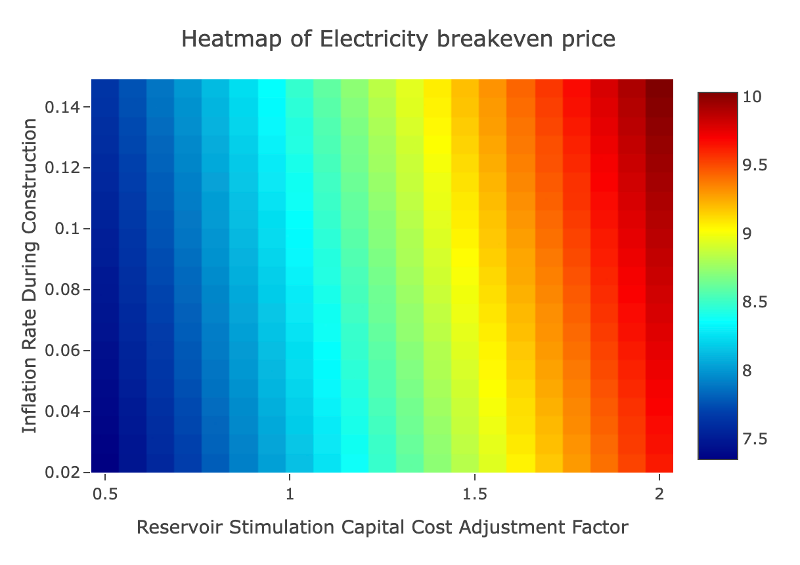
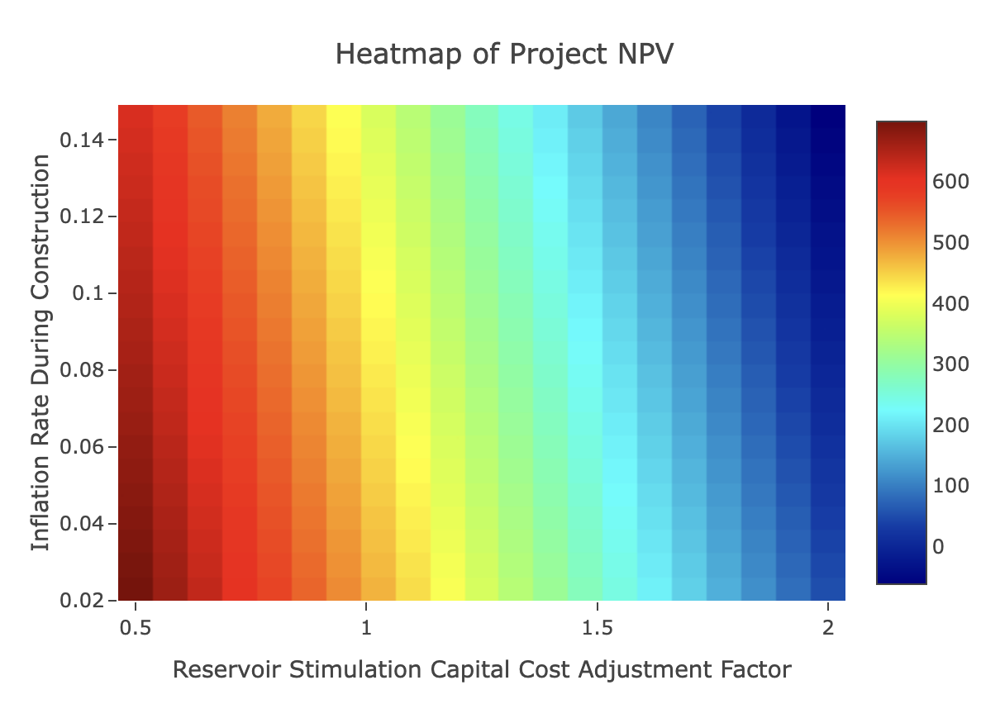

# Case Study: 500 MWe EGS Project Modeled on Fervo Cape Station

The GEOPHIRES example `Fervo_Project_Cape-4` is a case study of a 500 MWe EGS Project modeled
on Fervo Cape Station with its April 2025-announced
[upsizing from 400 MW to 500 MW](https://fervoenergy.com/fervo-energy-announces-31-mw-power-purchase-agreement-with-shell-energy/).
Case study inputs are formulated using a combination of publicly available data, extrapolations, and estimates.
Financial results are calculated
using
the [SAM Single Owner PPA Economic Model](https://softwareengineerprogrammer.github.io/GEOPHIRES/SAM-Economic-Models.html#sam-single-owner-ppa).

Key case study results include LCOE = $81.1/MWh and CAPEX = $5000/kW.

[Click here](https://gtp.scientificwebservices.com/geophires/?geophires-example-id=Fervo_Project_Cape-4) to
interactively explore the case study in the GEOPHIRES web interface.

## Approach & Methodology

The case study is constructed to be representative of a 500 MWe EGS project similar to Cape Station,
although it is not intended to be an exact facsimile.
This is because not all relevant data points are publicly available (e.g. full PPA terms) while others may not be
applicable
outside of Cape Station's first-of-a-kind status (such as drilling costs of initial wells which were more expensive
at [$4.8–9.4M per well](https://houston.innovationmap.com/fervo-energy-drilling-utah-project-2667300142.html)).

Exact values were used for publicly available technical and engineering parameters, such as reservoir
density ([2800 kg/m³](https://doi.org/10.31223/X52X0B)).
Some technical parameters were inferred with high confidence from publicly available data, such as geothermal
gradient ([74 ℃/km](https://pangea.stanford.edu/ERE/db/GeoConf/papers/SGW/2024/Fercho.pdf)) and well diameter.
Other parameters were extrapolated or speculatively estimated based on plausibility and/or compatibility with known
results, such as number of doublets.

The Inputs and Results tables below document key assumptions, inputs, and a comparison of results with reference
values.
Note that these are not the complete sets of inputs and results, which are available in source code and
the [web interface](https://gtp.scientificwebservices.com/geophires/?geophires-example-id=Fervo_Project_Cape-4).

## Inputs

See [Fervo_Project_Cape-4.txt](https://github.com/softwareengineerprogrammer/GEOPHIRES/blob/main/tests/examples/Fervo_Project_Cape-4.txt)
in source code for the full set of inputs.

### Economic Parameters

| Parameter                                                 | Input Value(s)                                                                                                        | Source                                                                                                                                                                                                                                                                                                                                                                                                                                                                                                                                                                                    |
|-----------------------------------------------------------|-----------------------------------------------------------------------------------------------------------------------|-------------------------------------------------------------------------------------------------------------------------------------------------------------------------------------------------------------------------------------------------------------------------------------------------------------------------------------------------------------------------------------------------------------------------------------------------------------------------------------------------------------------------------------------------------------------------------------------|
| Economic Model                                            | SAM Single Owner PPA                                                                                                  | The SAM Single Owner PPA economic model is used to calculate financial results including LCOE, NPV, IRR, and pro-forma cash flow analysis. See [GEOPHIRES documentation of SAM Economic Models](https://softwareengineerprogrammer.github.io/GEOPHIRES/SAM-Economic-Models.html) for details on how System Advisor Model financial models are integrated into GEOPHIRES.                                                                                                                                                                                                                  |
| Inflation Rate                                            | 2.3%                                                                                                                  | US inflation rate as of April 2025                                                                                                                                                                                                                                                                                                                                                                                                                                                                                                                                                        |
| PPA Price                                                 | Starting at 9.5 cents/kWh, escalating to 10 cents/kWh by project year 11                                              | Upper end of ranges given in 2024 NREL ATB (NREL, 2024). Both PPAs 'firm for 10 years at less than $100/MWh' estimate given in a podcast.                                                                                                                                                                                                                                                                                                                                                                                                                                                 |
| Well Drilling Cost Correlation & Adjustment Factor        | Vertical large baseline correlation + adjustment factor = 0.8 to align with Fervo claimed drilling costs of <$4M/well | Akindipe & Witter, 2025;  Latimer, 2025.                                                                                                                                                                                                                                                                                                                                                                                                                                                                                                                                                  |
| Reservoir Stimulation Capital Cost per Well               | $4.6M (all-in cost, including 15% contingency)                                                                        | The all-in cost is based on a ~$4.0M baseline stimulation cost, calibrated from per-stage costs of high-intensity U.S. shale wells (Baytex Energy, 2024; Quantum Proppant Technologies, 2020), which are the closest technological analogue for multi-stage EGS (Gradl, 2018). This baseline assumes standard sand proppant. The 15% contingency (~$0.6M) accounts for the necessary upgrade to ceramic proppant, which is required to resist mechanical crushing and geochemical degradation (diagenesis) over a 30-year well life at 200°C (Ko et al., 2023; Shiozawa & McClure, 2014). |
| Capital Cost for Power Plant for Electricity Generation   | $1900/kW                                                                                                              | US DOE, 2021.                                                                                                                                                                                                                                                                                                                                                                                                                                                                                                                                                                             |
| Discount Rate                                             | 12%                                                                                                                   | Typical discount rates for high-risk projects may be 12–15%                                                                                                                                                                                                                                                                                                                                                                                                                                                                                                                               |
| Inflated Bond Interest Rate                               | 5.6%                                                                                                                  | Typical debt annual interest rate                                                                                                                                                                                                                                                                                                                                                                                                                                                                                                                                                         |
| Fraction of Investment in Bonds (percent debt vs. equity) | 60%                                                                                                                   | Approximate remaining percentage of CAPEX with $1 billion sponsor equity per Matson, 2024. Note that this source says that Fervo ultimately wants to target "15% sponsor equity, 15% bridge loan, and 70% construction to term loans", but this case study does not attempt to model that capital structure.                                                                                                                                                                                                                                                                              |
| Exploration Capital Cost                                  | $30M                                                                                                                  | Estimate significantly higher exploration costs than default correlation in consideration of potential risks associated with second/third/fourth-of-a-kind EGS projects                                                                                                                                                                                                                                                                                                                                                                                                                   |
| Investment Tax Credit Rate (ITC)                          | 30%                                                                                                                   | Same as 400 MWe case study (Fervo_Project_Cape-3)                                                                                                                                                                                                                                                                                                                                                                                                                                                                                                                                         |
| Construction Years                                        | 1                                                                                                                     | Calibrated to a 2-6 year construction time for a 1 GW plant (Yusifov & Enriquez, 2025)                                                                                                                                                                                                                                                                                                                                                                                                                                                                                                    |

### Technical & Engineering Parameters

| Parameter                     | Input Value(s)             | Source                                                                                                                                                                                                                                                                                                                                         |
|-------------------------------|----------------------------|------------------------------------------------------------------------------------------------------------------------------------------------------------------------------------------------------------------------------------------------------------------------------------------------------------------------------------------------|
| Plant Lifetime                | 30 years                   | 30-year well life per Fervo Energy, 2025 (Geothermal Mythbusting: Water Use and Impacts).                                                                                                                                                                                                                                                      |
| Construction time             | 1 year                     | Calibrated to a 2–6 year construction time for a 1 GW plant (Yusifov & Enriquez, 2025). Note that the Inflation Rate During Construction parameter hedges against potential construction delays.                                                                                                                                               |
| Well diameter                 | 9⅝ inches                  | Next standard size up from 7", implied by announcement of "increasing casing diameter"                                                                                                                                                                                                                                                         |
| Flow Rate per Production Well | 107 kg/s                   | Fercho et al, 2025 models reservoir performance using 100 kg/s per well. The announced increased casing diameter implies higher flow rates, so the case study uses the maximum flow rate achieved at Cape Station of 107 kg/s per Fervo Energy, 2024.                                                                                          |
| Number of Doublets            | 59                         | Estimate based on extrapolation from previous case studies including [Project Red](https://gtp.scientificwebservices.com/geophires/?geophires-example-id=Fervo_Norbeck_Latimer_2023) and [Fervo_Project_Cape-3](https://gtp.scientificwebservices.com/geophires/?geophires-example-id=Fervo_Project_Cape-3)                                    |
| Number of Fractures per well  | 102                        | Estimate. (Note this is not a direct GEOPHIRES input parameter but was used to calculate other case study GEOPHIRES input parameters such as reservoir volume.)                                                                                                                                                                                |
| Fracture Separation           | 18 m                       | Per Norbeck et al, 2024: lateral length is 4700 ft = 1432 m. Dividing 1432 by 80 = ~18 m fracture spacing.                                                                                                                                                                                                                                     |
| Fracture Geometry             | 165.3 m × 165.3 m (Square) | Extrapolated from 30 million ft² fracture surface area per well per Fercho et al, 2025.                                                                                                                                                                                                                                                        |
| Reservoir Volume              | 5,919,217,617 m³           | Calculated from fracture area (27,324.09 m²) × fracture separation (18 m) × targeted number of fractures per well (102)                                                                                                                                                                                                                        |
| Water Loss Rate               | 15%                        | Water loss rate is conservatively estimated to be between 10 and 20%. Other estimates and some simulations may suggest a significantly lower water loss rate than this conservative estimate. See [Geothermal Mythbusting: Water Use and Impacts](https://fervoenergy.com/geothermal-mythbusting-water-use-and-impacts/) (Fervo Energy, 2025). |
| Maximum Drawdown              | 0.0153                     | Tuned to keep minimum net electricity generation ≥ 500 MWe and thermal breakthrough requiring redrilling occurring every 5–10 years                                                                                                                                                                                                            |
| Reservoir Impedance           | 0.001565 GPa.s/m³          | Yields ~15% initial pumping power/net installed power                                                                                                                                                                                                                                                                                          |
| Injection Temperature         | 53.6 ℃                     | Calibrated with GEOPHIRES model-calculated reinjection temperature (Beckers & McCabe, 2019). Close to upper bound of Project Red injection temperatures (75–125℉; 23.89–51.67℃) (Norbeck & Latimer, 2023).                                                                                                                                     |

## Results

See [Fervo_Project_Cape-4.out](https://github.com/softwareengineerprogrammer/GEOPHIRES/blob/main/tests/examples/Fervo_Project_Cape-4.out)
in source code for the complete results.

### Economic Results

| Metric                             | Result Value                                           | Reference Value(s)                                             | Reference Source                                 |
|------------------------------------|--------------------------------------------------------|----------------------------------------------------------------|--------------------------------------------------|
| LCOE                               | $81.1/MWh                                              | $80/MWh                                                        | Horne et al, 2025                                |
| Project capital costs: Total CAPEX | $2.66B                                                 |                                                                |                                                  |
| Project capital costs: $/kW        | $5000/kW (based on maximum net electricity generation) | $5000/kW; $4500/kW; $3000–$6000/kW                             | McClure, 2024; Horne et al, 2025; Latimer, 2025. |
| Well Drilling and Completion Costs | $3.96M/well; $467.75M total                            | $<4M/well                                                      | Latimer, 2025.                                   |
| Stimulation Costs                  | $4.6M/well; $542.8M total                              | $4.65M/well (based on 46%:54% drilling:stimulation cost ratio) | (Yusifov & Enriquez, 2025)                       |
| WACC                               | 8.3%                                                   | 8.3%                                                           | Matson, 2024.                                    |
| After-tax IRR                      | 27.55%                                                 | 15–25%                                                         | Typical levered returns for energy projects      |

### Technical & Engineering Results

| Metric                                          | Result Value | Reference Value(s)                                 | Reference Source                                                                                                                                                                                                            |
|-------------------------------------------------|--------------|----------------------------------------------------|-----------------------------------------------------------------------------------------------------------------------------------------------------------------------------------------------------------------------------|
| Minimum Net Electricity Generation              | 504 MW       | 500 MW                                             | Fervo Energy, 2025. The 500 MW PPA is interpreted to mean that Cape Station's net electricity generation must never fall below 500 MWe.                                                                                     |
| Maximum Net Electricity Generation              | 537 MW       |                                                    |                                                                                                                                                                                                                             |
| Maximum Total Electricity Generation            | 615 MW       |                                                    | Actual maximum total generation may be bounded or constrained by modular power plant design not modeled in this case study. For example, a modular design with 50MW units may constrain maximum total generation to 600 MW. |
| Number of times redrilling                      | 3            | 3–6                                                | Redrilling expected to be required within 5–10 years of project start                                                                                                                                                       |
| Average Production Temperature                  | 199℃         | 204℃, 190.6–198.6℃ (optimal plant operating range) | Trent, 2024; Norbeck et al, 2024.                                                                                                                                                                                           |
| Total fracture surface area per production well | 2.787×10⁶ m² | 2.787×10⁶ m² (30 million ft² per well)             | Fercho et al, 2025.                                                                                                                                                                                                         |

## Uncertainty & Sensitivities

Given the methodological approach, including speculative estimation of some input parameters, and lack of real-world
reference data for comparison, the case study results are subject to uncertainty. Users may wish to perform their own
sensitivity analysis using [GEOPHIRES's Monte Carlo simulation module](Monte-Carlo-User-Guide.html) or other data analysis tools.

### Stimulation & Construction Inflation Costs

The following heatmaps visualize Electricity breakeven price (LCOE) and NPV sensitivity to stimulation cost and inflation costs during construction (a proxy for construction delays and cost overruns).
Stimulation costs were tested from $2.3M/well (Reservoir Stimulation Capital Cost Adjustment Factor = 0.5) to $9.2M/well (Reservoir Stimulation Capital Cost Adjustment Factor = 2).
Construction inflation costs were tested from $53.58M (Inflation Rate During Construction = 2.3%) to $340.13M (Inflation Rate During Construction = 14.6%).

## References

Akindipe, D. and Witter. E. (2025). "2025 Geothermal Drilling Cost Curves
Update". https://pangea.stanford.edu/ERE/db/GeoConf/papers/SGW/2025/Akindipe.pdf?t=1740084555

Baytex Energy. (2024). Eagle Ford Presentation.
https://www.baytexenergy.com/content/uploads/2024/04/24-04-Baytex-Eagle-Ford-Presentation.pdf

Beckers, K., McCabe, K. (2019) GEOPHIRES v2.0: updated geothermal techno-economic simulation tool. Geotherm Energy
7,5. https://doi.org/10.1186/s40517-019-0119-6

Fercho, S., Norbeck, J., Dadi, S., Matson, G., Borell, J., McConville, E., Webb, S., Bowie, C., & Rhodes, G. (2025).
Update on the geology, temperature, fracturing, and resource potential at the Cape Geothermal Project informed by data
acquired from the drilling of additional horizontal EGS wells. Proceedings of the 50th Workshop on Geothermal Reservoir
Engineering, Stanford University, Stanford, CA. https://pangea.stanford.edu/ERE/pdf/IGAstandard/SGW/2025/Fercho.pdf

Fervo Energy. (2025, March 31). Geothermal Mythbusting: Water Use and
Impacts. https://fervoenergy.com/geothermal-mythbusting-water-use-and-impacts/

Fervo Energy. (2025, April 15). Fervo Energy Announces 31 MW Power Purchase Agreement with Shell
Energy. https://fervoenergy.com/fervo-energy-announces-31-mw-power-purchase-agreement-with-shell-energy/

Fervo Energy. (2024, September 10). Fervo Energy’s Record-Breaking Production Results Showcase Rapid Scale Up of
Enhanced
Geothermal. https://www.businesswire.com/news/home/20240910997008/en/Fervo-Energys-Record-Breaking-Production-Results-Showcase-Rapid-Scale-Up-of-Enhanced-Geothermal

Gradl, C. (2018). SReview of Recent Unconventional Completion Innovations and their Applicability to EGS Wells. Stanford
Geothermal Workshop.
https://pangea.stanford.edu/ERE/pdf/IGAstandard/SGW/2018/Gradl.pdf

Horne, R., Genter, A., McClure, M. et al. (2025) Enhanced geothermal systems for clean firm energy generation. Nat. Rev.
Clean Technol. 1, 148–160. https://doi.org/10.1038/s44359-024-00019-9

Jacobs, Trent.  (2024, September 16). Fervo and FORGE Report Breakthrough Test Results, Signaling More Progress for
Enhanced
Geothermal. https://jpt.spe.org/fervo-and-forge-report-breakthrough-test-results-signaling-more-progress-for-enhanced-geothermal

Ko, S., Ghassemi, A., & Uddenberg, M. (2023). Selection and Testing of Proppants for EGS.
Proceedings, 48th Workshop on Geothermal Reservoir Engineering, Stanford University, Stanford, California.
https://pangea.stanford.edu/ERE/db/GeoConf/papers/SGW/2023/Ko.pdf

Latimer, T. (2025, February 12). Catching up with enhanced geothermal (D. Roberts,
Interviewer). https://www.volts.wtf/p/catching-up-with-enhanced-geothermal

Matson, M. (2024, September 11). Fervo Energy Technology Day 2024: Entering "the Geothermal Decade" with Next-Generation
Geothermal
Energy. https://www.linkedin.com/pulse/fervo-energy-technology-day-2024-entering-geothermal-decade-matson-n4stc/

McClure, M. (2024, September 12). Digesting the Bonkers, Incredible, Off-the-Charts, Spectacular Results from the Fervo
and FORGE Enhanced Geothermal Projects. ResFrac Corporation Blog.
https://www.resfrac.com/blog/digesting-the-bonkers-incredible-off-the-charts-spectacular-results-from-the-fervo-and-forge-enhanced-geothermal-projects

NREL. (2024). Annual Technology Baseline: Recent Public Geothermal Power Purchase Agreement
Pricing. https://atb.nrel.gov/electricity/2024/geothermal

Norbeck, J., Gradl, C., Latimer, T. (2024, September 10). Deployment of Enhanced Geothermal System Technology Leads to
Rapid Cost Reductions and Performance Improvements. https://doi.org/10.31223/X5VH8C

Norbeck J., Latimer T. (2023). Commercial-Scale Demonstration of a First-of-a-Kind Enhanced Geothermal
System. https://doi.org/10.31223/X52X0B

Quantum Proppant Technologies. (2020). Well Completion Technology. World
Oil. https://quantumprot.com/uploads/images/2b8583e8ce8038681a19d5ad1314e204.pdf

Shiozawa, S., & McClure, M. (2014). EGS Designs with Horizontal Wells, Multiple Stages, and Proppant. ResFrac.
https://www.resfrac.com/wp-content/uploads/2024/07/Shiozawa.pdf

US DOE. (2021). Combined Heat and Power Technology Fact Sheet Series: Waste Heat to
Power. https://betterbuildingssolutioncenter.energy.gov/sites/default/files/attachments/Waste_Heat_to_Power_Fact_Sheet.pdf

Yusifov, M., & Enriquez, N. (2025, July). From Core to Code: Powering the Al Revolution with Geothermal Energy.
Project InnerSpace. https://projectinnerspace.org/resources/Powering-the-AI-Revolution.pdf
