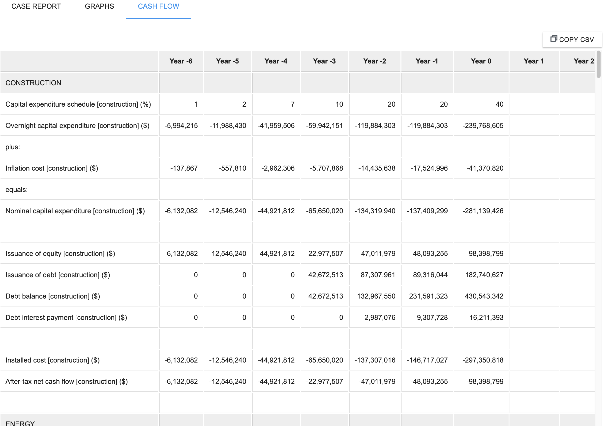
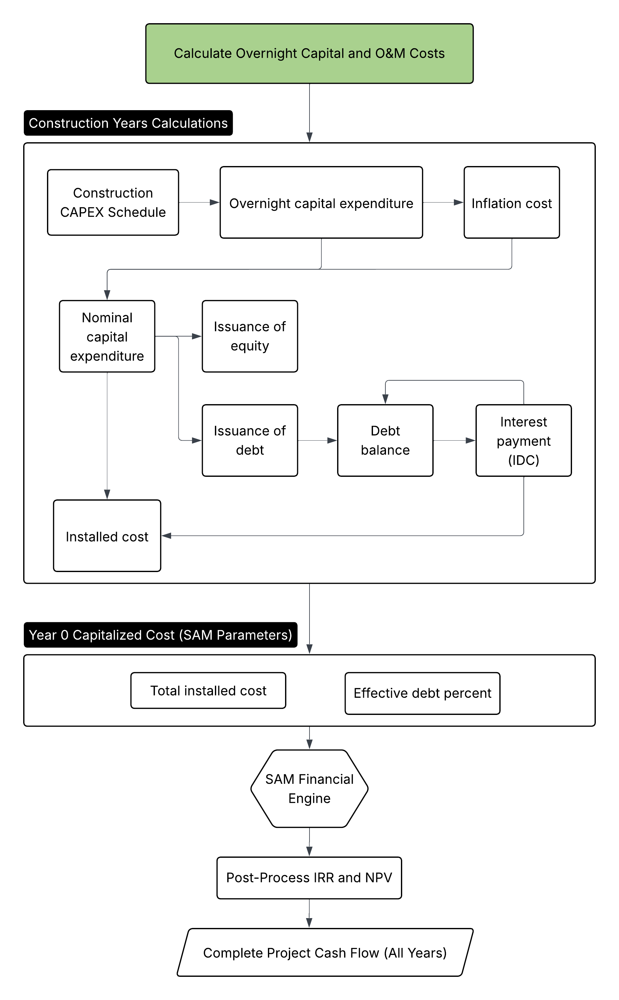
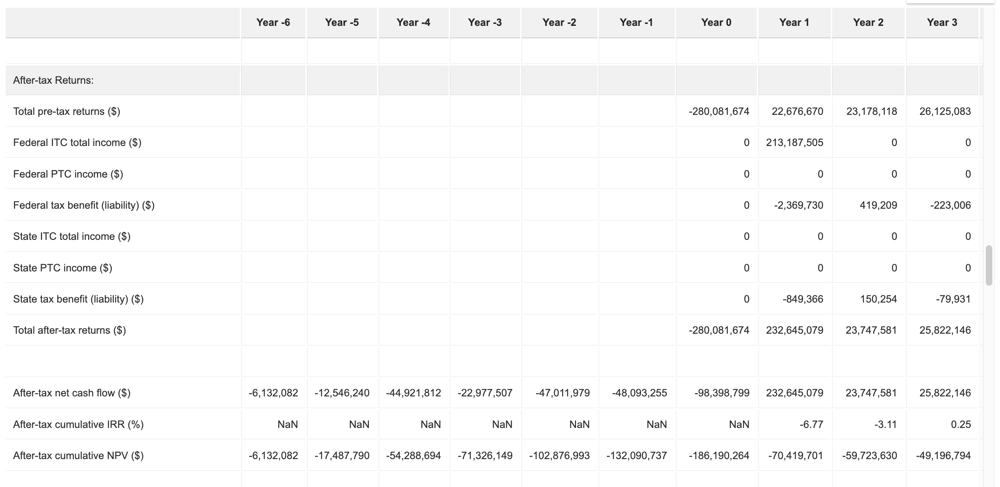

# SAM Economic Models: Multiple Construction Years

[Multiple Construction Years example web interface link](https://gtp.scientificwebservices.com/geophires/?geophires-example-id=example_SAM-single-owner-PPA-5)

GEOPHIRES SAM Economic Models support multi-year construction timelines to deliver accurate, time-adjusted financial
metrics, including IRR and NPV, for projects with extended development periods.
This feature models the pre-revenue phase to capture the real-world economic impact of Interest During Construction (
IDC), inflation, and capital deployment timing.
This ensures that key investment decision metrics correctly reflect the time value of money leading up to the Commercial
Operation Date (COD).

To enable this feature, set the `Construction Years` parameter to the desired duration (e.g., 3). The spending profile
is defined by the `Construction CAPEX Schedule`, which allocates a percentage of the `Overnight Capital Cost` to each
pre-revenue year. Users can further refine the financing model using `Bond Financing Start Year` to delay debt
drawdowns (funding early years purely with equity) and adjust `Inflation Rate During Construction` or
`Inflated Bond Interest Rate During Construction` to match specific market conditions.

## Construction Cash Flows

The `CONSTRUCTION` cash flow category displays detailed financial movements during the pre-operational phase.
Construction-specific line items are suffixed with `[construction]`.
Construction years are indexed relative to the first year of operations (Year 1).
A project with three construction years will have cash flows in Year -2, Year -1 and Year 0.
A project with seven construction years, as in the example below, will start in Year -6.

## Construction Years Calculations

For each construction year, the `CONSTRUCTION` cash flow is calculated as follows:

1. **CAPEX Deployment**: GEOPHIRES calculates `Overnight capital expenditure [construction]` as a
   percentage of the total `Overnight Capital Cost` based on the `Construction CAPEX Schedule`.
1. **Inflation**: An inflation adder is calculated using `Inflation Rate During Construction` and added to the overnight
   cost to yield `Nominal capital expenditure [construction]`.
1. **Debt & Equity Draws**: Costs are covered by issuance of equity and debt based on `Fraction of Investment in Bonds`.
   Debt
   financing can be delayed by specifying `Bond Financing Start Year`. Years prior to this threshold are financed 100%
   by equity.
1. **IDC (Interest During Construction)**: Interest on the accumulated debt balance is calculated using
   `Inflated Bond Interest Rate During Construction`. This interest is capitalized (added to
   `Debt balance [construction]`) rather than paid out as cash.
1. **Annual Installed Cost**: The annual `Installed cost [construction]` is the sum of
   `Nominal capital expenditure [construction]` and `Debt interest payment [construction]` (capitalized IDC).

## Operational Years (SAM Integration)

At the end of the construction phase, total installed cost and effective debt percentage are passed to the SAM financial
engine.
This ensures the operational model starts with the correct depreciation basis and loan principal.
Annual `Installed cost [construction]` values are
summed to calculate the total installed cost that is passed to SAM (`total_installed_cost`).
`Issuance of equity [construction]` and `Issuance of debt [construction]` are summed to compute an effective debt:equity
ratio that is passed to SAM (`debt_percent`).

## Post-Processing (Timeline-adjusted Metrics)

After SAM computes the operational cash flows, GEOPHIRES merges the construction phase and
operational phase net cash flows together to report accurate project-level metrics.
The merged `After-tax net cash flow ($)` row represents the complete project lifecycle:

- Years -N to 0: Contains `After-tax net cash flow [construction] ($)` (equity outflows).
- Years 1+: Contains `Total after-tax returns ($)` from operations.

`After-tax cumulative IRR (%)` and `After-tax cumulative NPV ($)` are re-calculated based on this unified cash flow
stream to account for the time value of money during the construction delay.

---

See [SAM Economic Models documentation](SAM-Economic-Models.html).
