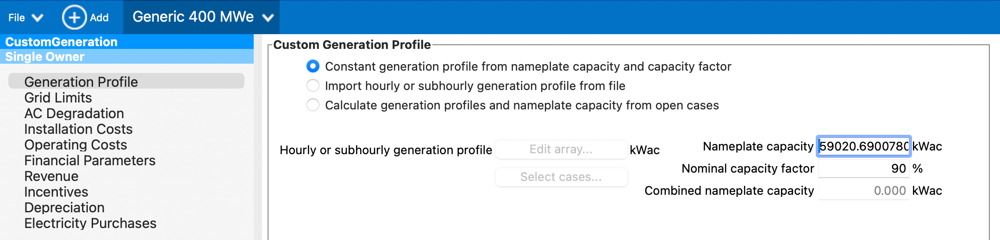

# SAM Economic Models

GEOPHIRES SAM Economic Models leverage [NREL's SAM Financial Models](https://sam.nrel.gov/financial-models.html)
by transforming GEOPHIRES parameters into SAM parameters and running the corresponding SAM model
with [PySAM](https://github.com/NREL/pysam).

## SAM Single Owner PPA

Corresponding SAM Financial
Model: [Power Purchase Agreement (PPA): Single owner](https://sam.nrel.gov/financial-models/utility-scale-ppa)

### Parameters

The following table describes how GEOPHIRES parameters are transformed into SAM parameters, as implemented in
[EconomicsSam.py](https://github.com/softwareengineerprogrammer/GEOPHIRES/blob/274786e6799d32dad3f42a2a04297818b811f24c/src/geophires_x/EconomicsSam.py#L135-L195).
(Note that the source code implementation determines actual behavior in the case of any discrepancies.)

| GEOPHIRES Parameter(s)                                                                                                                          | SAM Category                                           | SAM Input(s)                                                                                                 | SAM Module(s)                     | SAM Parameter Name(s)                                        | Comment                                                                                                                                                                                                                                                                                                                   |
|-------------------------------------------------------------------------------------------------------------------------------------------------|--------------------------------------------------------|--------------------------------------------------------------------------------------------------------------|-----------------------------------|--------------------------------------------------------------|---------------------------------------------------------------------------------------------------------------------------------------------------------------------------------------------------------------------------------------------------------------------------------------------------------------------------|
| `Maximum Total Electricity Generation`                                                                                                          | Generation Profile                                     | `Nameplate capacity`                                                                                         | `Singleowner`                     | `system_capacity`                                            | .. N/A                                                                                                                                                                                                                                                                                                                    |
| `Utilization Factor`                                                                                                                            | Generation Profile                                     | `Nominal capacity factor`                                                                                    | `Singleowner`                     | `user_capacity_factor`                                       | .. N/A                                                                                                                                                                                                                                                                                                                    |
| `Net Electricity Generation`                                                                                                                    | AC Degradation                                         | `Annual AC degradation rate` schedule                                                                        | `Utilityrate5`                    | `degradation`                                                | Percentage difference of each year's `Net Electricity Generation` from `Maximum Total Electricity Generation` is input as SAM as the degradation rate schedule in order to match SAM's generation profile to GEOPHIRES                                                                                                    |
| {`Total CAPEX` before inflation} × (1 + `Accrued financing during construction (%)`/100);                                                       | Installation Costs                                     | `Total Installed Cost`                                                                                       | `Singleowner`                     | `total_installed_cost`                                       | `Accrued financing during construction (%)` = (1+`Inflation Rate During Construction`) × 100 if `Inflation Rate During Construction` is provided or ((1+`Inflation Rate`) ^ `Construction Years`) × 100 if not.                                                                                                           |
| `Total O&M Cost`, `Inflation Rate`                                                                                                              | Operating Costs                                        | `Fixed operating cost`, `Escalation rate` set to `Inflation Rate` × -1                                       | `Singleowner`                     | `om_fixed`, `om_fixed_escal`                                 | .. N/A                                                                                                                                                                                                                                                                                                                    |
| `Plant Lifetime`                                                                                                                                | Financial Parameters → Analysis Parameters             | `Analysis period`                                                                                            | `CustomGeneration`, `Singleowner` | `CustomGeneration.analysis_period`, `Singleowner.term_tenor` | .. N/A                                                                                                                                                                                                                                                                                                                    |
| `Inflation Rate`                                                                                                                                | Financial Parameters → Analysis Parameters             | `Inflation rate`                                                                                             | `Utilityrate5`                    | `inflation_rate`                                             | .. N/A                                                                                                                                                                                                                                                                                                                    |
| `Discount Rate`                                                                                                                                 | Financial Parameters → Analysis Parameters             | `Real discount rate`                                                                                         | `Singleowner`                     | `real_discount_rate`                                         | .. N/A                                                                                                                                                                                                                                                                                                                    |
| `Combined Income Tax Rate`                                                                                                                      | Financial Parameters → Project Tax and Insurance Rates | `Federal income tax rate`\: minimum of {21%, CITR}; and `State income tax rate`: maximum of {0%; CITR - 21%} | `Singleowner`                     | `federal_tax_rate`,  `state_tax_rate`                        | GEOPHIRES does not have separate parameters for federal and state income tax so the rates are split from the combined rate based on an assumption of a maximum federal tax rate of 21% and the residual amount being the state tax rate.                                                                                  |
| `Property Tax Rate`                                                                                                                             | Financial Parameters                                   | `Property tax rate`                                                                                          | `Singleowner`                     | `property_tax_rate`                                          | .. N/A                                                                                                                                                                                                                                                                                                                    |
| `Fraction of Investment in Bonds`                                                                                                               | Financial Parameters → Project Term Debt               | `Debt percent`                                                                                               | `Singleowner`                     | `debt_percent`                                               | .. N/A                                                                                                                                                                                                                                                                                                                    |
| `Inflated Bond Interest Rate`                                                                                                                   | Financial Parameters → Project Term Debt               | `Annual interest rate`                                                                                       | `Singleowner`                     | `term_int_rate`                                              | .. N/A                                                                                                                                                                                                                                                                                                                    |
| `Starting Electricity Sale Price`, `Ending Electricity Sale Price`, `Electricity Escalation Rate Per Year`, `Electricity Escalation Start Year` | Revenue                                                | `PPA price`                                                                                                  | `Singleowner`                     | `ppa_price_input`                                            | GEOPHIRES's pricing model is used to create a PPA price schedule that is passed to SAM.                                                                                                                                                                                                                                   |
| `Total AddOn Profit Gained`                                                                                                                     | Revenue → Capacity Payments                            | `Fixed amount`, `Capacity payment amount`                                                                    | `Singleowner`                     | `cp_capacity_payment_type = 1`, `cp_capacity_payment_amount` |                                                                                                                                                                                                                                                                                                                           |
| `Investment Tax Credit Rate`                                                                                                                    | Incentives → Investment Tax Credit (ITC)               | `Federal` → `Percentage (%)`                                                                                 | `Singleowner`                     | `itc_fed_percent`                                            | Note that unlike the BICYCLE Economic Model's `Total capital costs`, SAM Economic Model's `Total CAPEX` is the total installed cost and does not subtract ITC value (if present).                                                                                                                                         |
| `Production Tax Credit Electricity`                                                                                                             | Incentives → Production Tax Credit (PTC)               | `Federal` → `Amount ($/kWh)`                                                                                 | `Singleowner`                     | `ptc_fed_amount`                                             | .. N/A                                                                                                                                                                                                                                                                                                                    |
| `Production Tax Credit Duration`                                                                                                                | Incentives → Production Tax Credit (PTC)               | `Federal` → `Term (years)`                                                                                   | `Singleowner`                     | `ptc_fed_term`                                               | .. N/A                                                                                                                                                                                                                                                                                                                    |
| `Production Tax Credit Inflation Adjusted`, `Inflation Rate`                                                                                    | Incentives → Production Tax Credit (PTC)               | `Federal` → `Escalation (%/yr)`                                                                              | `Singleowner`                     | `ptc_fed_escal`                                              | If `Production Tax Credit Inflation Adjusted` = True, GEOPHIRES set's SAM's PTC escalation rate to the inflation rate. SAM applies the escalation rate to years 2 and later of the project cash flow. Note that this produces escalation rates that are similar to inflation-adjusted equivalents, but not exactly equal. |
| `Other Incentives` + `One-time Grants Etc`                                                                                                      | Incentives → Investment Based Incentive (IBI)          | `Other`  → `Amount ($)`                                                                                      | `Singleowner`                     | `ibi_oth_amount`                                             | .. N/A                                                                                                                                                                                                                                                                                                                    |

.. <RST_Comment>
.. Comment entries of ".. N/A" render as blank in the final RST, by design.
.. This entry value is required because m2r2 (https://pypi.org/project/m2r2/) seems to choke and bail on rendering
.. the entire table when blank comment entries are blank. Make sure to check this doesn't happen when making changes
.. to this file by running `tox -e docs` and opening `dist/docs/SAM-Economic-Models.html` in your browser!
..
.. TODO: Generate this programmatically (like schema generator) to prevent drift between code and documentation.
.. </RST_Comment>

### Limitations

1. Only Electricity end-use is supported
2. Only 1 construction year is supported. Note that the `Inflation Rate During Construction` parameter can be used to
   partially account for longer construction periods.
3. Add-ons electricity and heat are not currently supported. (Add-ons CAPEX, OPEX, and profit are supported.)

## Using SAM Economic Models with Existing GEOPHIRES Inputs

In many cases, all you need to do to use SAM Economic Models for your existing GEOPHIRES inputs is to change the
`Economic Model` parameter value.
For example, if your GEOPHIRES `.txt` file contained the following:

```
# *** Financial Parameters ***
Economic Model, 2, -- Standard Levelized Cost Model
Discount Rate, .05
Plant Lifetime, 25
```

You would change it to:

```
# *** Financial Parameters ***
Economic Model, 5, -- SAM Single Owner PPA Economic Model
Discount Rate, .05
Plant Lifetime, 25
```

For inputs with the BICYCLE economic model, such as the following:

```
# *** Financial Parameters ***
Economic Model, 3, -- BICYCLE
Inflated Equity Interest Rate, .08
Plant Lifetime, 30
```

Change `Economic Model` and replace `Inflated Equity Interest Rate` with a suitable `Discount Rate` and
`Inflation Rate`:

```
# *** Financial Parameters ***
Economic Model, 5, -- SAM Single Owner PPA Economic Model
Discount Rate, .08
Inflation Rate, .03
Plant Lifetime, 30
```

## Re-creating SAM Economic Model Results in the SAM Desktop Application

First, open `src/geophires_sam_economics/Generic_400_MWe.sam`
in the SAM desktop application.

Next, run GEOPHIRES for your input, e.g.:

```
python -mgeophires_x my-geophires-input.txt
```

Then check `src/geophires_x/all_messages_conf.log` for the SAM Economics Parameter Mapping entry:

```
23-05-2025 10:09:35 : INFO : EconomicsSam : calculate_sam_economics : 151 : (Process Details : (1378, MainProcess), Thread Details : (8589068352, MainThread)): SAM Economics Parameter Mapping:
-----------------  --------------------  -------------------------------------------------------------------------------------------------------------------------------------------------------------------------------------------------------------------------------------------------------------------------------------------------------------------------------------------------------------------------------------------------------------
SAM Module         Parameter             Value
Custom Generation  analysis_period       20
Custom Generation  user_capacity_factor  90.0
Utility Rate       inflation_rate        2.0
Utility Rate       degradation           [1.2734946600673935, 0.7001040275842613, 0.5267634676194525, 0.4244824247238818, 0.3529717582311231, 0.29852256883429373, 0.2548483024454293, 0.21855974702202877, 0.18762922644042462, 0.1607514026827296, 0.13703877682895466, 0.11586181507372084, 0.09675857340703789, 0.07938054662917803, 0.06345865490418974, 0.0487810281945756, 0.03517801101748528, 0.02251175220012943, 0.010668799824934945, 0.0]
Single Owner       analysis_period       20
Single Owner       total_installed_cost  264606243.76608825
Single Owner       om_fixed              [7193902.821741002]
Single Owner       om_fixed_escal        -2.0
Single Owner       system_capacity       59020.69007804236
Single Owner       federal_tax_rate      [21.0]
Single Owner       state_tax_rate        [7.0]
Single Owner       itc_fed_percent       [30.0]
Single Owner       property_tax_rate     0.0
Single Owner       ppa_price_input       [0.08, 0.08, 0.08322, 0.08644, 0.08966, 0.09288, 0.0961, 0.09932, 0.10254, 0.10576, 0.10898000000000001, 0.1122, 0.11542, 0.11864, 0.12186, 0.12508, 0.1283, 0.13152, 0.13474, 0.13796]
Single Owner       debt_percent          40.0
Single Owner       real_discount_rate    8.0
Single Owner       term_tenor            20
Single Owner       term_int_rate         5.0
Single Owner       ibi_oth_amount        0.0
-----------------  --------------------  -------------------------------------------------------------------------------------------------------------------------------------------------------------------------------------------------------------------------------------------------------------------------------------------------------------------------------------------------------------------------------------------------------------
```

You can then manually enter the parameters from the logged mapping into the SAM desktop app.



## Add-Ons

SAM Economic Models incorporate add-ons directly, unlike other GEOPHIRES economic models, which calculate separate
extended economics.
Total Add-on CAPEX is added to Total CAPEX.
Total Add-on OPEX is added to Total operating and maintenance costs.
Total AddOn Profit Gained per year is treated as fixed amount Capacity payment revenue.

## Examples

### SAM Single Owner PPA: 50 MWe

[Web interface link](https://gtp.scientificwebservices.com/geophires/?geophires-example-id=example_SAM-single-owner-PPA)

### Case Study: 500 MWe EGS Project Modeled on Fervo Cape Station

[Web interface link](https://gtp.scientificwebservices.com/geophires/?geophires-example-id=Fervo_Project_Cape-4)

See [Case Study: 500 MWe EGS Project Modeled on Fervo Cape Station](Fervo_Project_Cape-4.html).
