# Theoretical Basis for GEOPHIRES

This is adapted from [GEOPHIRES v2.0: updated geothermal techno-economic simulation tool](https://doi.org/10.1186/s40517-019-0119-6) (Koenraad F. Beckers & Kevin McCabe, 2019).

## Built‑in models and correlations

### End‑use options

Five different end-use options are available in GEOPHIRES:

1. _Electricity_ All produced geothermal fluid is used to generate electricity with either an ORC or flash power plant.
2. _Direct-use heat_ All produced geothermal fluid is used to provide heating for a given application, e.g., a district-heating system or industrial process.
3. _Cogeneration or combined heat and power (CHP)_ Both heat and electricity are produced. Three different cogeneration configurations are available:
   1. _Cogeneration topping cycle_ A power plant is followed by a direct-use heat application in series. Heat at high temperatures from the geothermal fluid is first converted into electricity. Any remaining heat in the geothermal fluid after leaving the power plant is supplied to a low-temperature direct-use heat application.
   2. _Cogeneration bottoming cycle_ A direct-use heat application is followed by a power plant in series. In this less common configuration, the geothermal fluid first serves a high-temperature direct-use heat application. Any remaining heat in the geothermal fluid after leaving the direct-use heat process (at a user-specified temperature) is used to generate electricity. The heat-to-power conversion typically occurs with an ORC plant operating at low conversion efficiencies.
   3. _Cogeneration parallel cycle_ A power plant operates in parallel with a direct-use heat application. The produced geothermal fluid is split into two streams, providing heat at the same temperature to a power plant and direct-use heat application. The user specifies the fluid flow fraction going to each process.

### Geofluid

The built-in fluid property correlations in GEOPHIRES for density, heat capacity, viscosity and vapor pressure are for pure water. However, these fluid property correlations are separate Python function in the open-source GEOPHIRES code which can easily be modified by the user for a different fluid, e.g., brine.

### Reservoir models

Nine reservoir models are available in GEOPHIRES to calculate the transient reservoir production temperature: (1) multiple parallel fractures model, (2) 1-dimensional linear heat sweep model, (3) _m/A_ thermal drawdown parameter model, (4) percentage temperature drawdown model, (5) generic user-provided temperature profile, (6) TOUGH2 reservoir simulator, (7) SUTRA: Reservoir Thermal Energy Storage (RTES, also known as Underground Thermal Energy Storage - UTES), (8) Slender Body Theory (SBT), and (9) Cylindrical. The user specifies the reservoir model in the input file, and validation of relevant parameters is then performed to ensure compatibility of the selected model with the specified parameters. The output of the reservoir simulation component is a production temperature profile over the life of the project.

The first model—the _Multiple Parallel Fractures Model_ (Gringarten et al. 1975[^1])—is based on a linear model in which the reservoir is represented by an infinite series of parallel, equidistant, vertical fractures of uniform thickness. Due to the fracture-dominated nature of this model, it is intended primarily for EGS applications. In this model, heat transport occurs through thermal convection with 1-D water flow in the fractures and thermal conduction within the homogeneous, isotropic, and impermeable rock. The governing equations for the temperature of the rock and water in time and space are specified and solved in the Laplace domain and numerically converted back into the time domain. The dimensionless water temperature _T_<i>WD</i> (°C) is defined as:

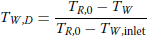

with _T_<i>W</i>,<i>D</i> the water temperature (°C), _T_<i>R</i>,0 the initial reservoir temperature (°C), and _T_<i>W</i>,inlet the water temperature at the reservoir inlet (°C). The full equation for the dimensionless temperature in Laplace space is given in Equation A17 in Gringarten et al. (1975)<a href="#fn-1">[1]</a>. The model in GEOPHIRES is simplified by assuming that the temperature in the reservoir—and therefore, at the top and bottom of the fracture—is constant. With the simplification, the geothermal gradient is zero and the equation specifying the dimensionless water temperature in the Laplace space, represented by:

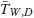

is given as:

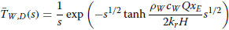

where _s_ is the Laplace variable (s−1), _ρ_<i>W</i> is the density of the water (kg m−3), _c_<i>W</i> is the specific heat capacity of the water (J kg−1 K−1), _Q_ is the volumetric flow rate per fracture per unit depth of the fracture (m2 s−1), _x_ is the half-width fracture separation (m), _k_<i>r</i> is the rock thermal conductivity (W m−1 K−1), and _H_ is the height of the fractures (m). In GEOPHIRES v2.0, the conversion of this equation in Laplace space to the time domain is performed using the _mpmath_ library (Johansson 2017[^2]).

The second model—the _1-Dimensional Linear Heat Sweep Model_ (Hunsbedt et al. 1984[^3])—also focuses on modeling fractured geothermal reservoirs and therefore may be best suited for EGS applications. The model assumes that the reservoir can be represented as a porous medium with fluid surrounding blocks of rock characterized by a lumped effective rock radius. Heat transport in this model occurs through 1-D linear heat sweep of water through the reservoir. The dimensionless water temperature is defined as:

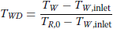

The full equation for the dimensionless temperature in Laplace space is given in Eqs. 2–7a in Hunsbedt et al. (1984<a href="#fn-3">[3]</a>). This model in GEOPHIRES is simplified by setting the recharge temperature parameter to − ∞ (which specifies the fluid temperature at the reservoir inlet to remain constant over the lifetime instead of slowly increasing due to injection wellbore heat gains) and the external heat transfer parameter to zero (which specifies zero heat flux at the reservoir boundary). Both assumptions reflect a conservative modeling approach and are recommended by Hunsbedt et al. (1984<a href="#fn-3">[3]</a>) for unknown reservoir conditions. Thus, the equation specifying dimensionless temperature at the production well is given as:

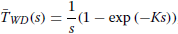

where

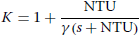

NTU and _γ_ are the number of heat transfer units and the heat storage ratio, respectively. They are given as:

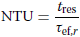

and

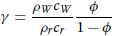

In these equations, _φ_ is the rock porosity (–), _ρ_<i>r</i> is the rock density (kg m−3), _c_<i>r</i> is the rock specific heat capacity (J kg−1 K−1), _t_res is the residence time of water in the reservoir (s), and _τ_ef,<i>r</i> is the effective rock time constant (s), which is calculated as:

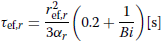

In this equation, _r_ef,<i>r</i> is the effective rock radius representing the entire collection of rock blocks (m), _α_<i>r</i> is the rock thermal diffusivity (m2 s−1), and _Bi_ is the Biot number (–). The value 0.2 represents the typical ratio of conduction path length to _r_ef,<i>r</i> for spherical shapes (Hunsbedt et al. 1984<a href="#fn-3">[3]</a>). The effective rock radius and the Biot number are calculated as:

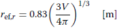

and

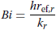

with _V_ being the mean volume of the rock block (m3) and _h_ being the rock surface heat transfer coefficient (W m−2 K−1). The factor 0.83 in Eq. (9) is the Kuo sphericity and represents the typical mean sphericity of a distribution of irregularly shaped rock blocks found in geothermal reservoirs (Hunsbedt et al. 1984<a href="#fn-3">[3]</a>). More information on default/assumed values for various parameters, including the heat transfer coefficient (_h_), was provided by Beckers (2016[^4]).

The third model—the _m/A Thermal Drawdown Parameter Model_—is discussed in detail by Armstead and Tester (1987[^5]). This model represents the reservoir as a single rectangular fracture of specified area with a uniform flow of fluid passing over the fracture surface. The mass loading parameter (_m/A_) is defined as the mass flow rate per unit area of a single side of the fracture (kg s−1 m−2) and is provided by the user, along with other rock properties. The dimensionless temperature is defined and calculated as:

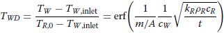

where erf is the error function and _t_ is the time in seconds.

The fourth model—the _Percentage Temperature Drawdown Model_—expresses the thermal drawdown as a percentage temperature decrease per year. Previous iterations of this reservoir model used an exponential decline to model the drawdown over time. However, results from Snyder et al. (2017a[^6]) demonstrate that a linear decline with an annual temperature drop based on the percentage of the initial production temperature may fit measured production data more closely. Thus, the dimensionless temperature is defined and calculated as:

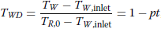

where _p_ is the percentage temperature decrease in units of years−1 and _t_ is the time in years.

The fifth model—the _Generic User-Provided Temperature Profile_—allows the user to specify and import a generic reservoir production temperature profile, with temperature data from an external simulation tool or measured data from an operating geothermal plant. The format for providing a generic temperature profile is via column vectors in a text file. An example case study using this reservoir model is included in the GEOPHIRES GitHub folder (example 2).

The sixth model—the _TOUGH2 Geothermal Reservoir Simulator_—is for nonisothermal multiphase flow in fractured porous media (Pruess et al. 1999[^7]). Its capabilities allow GEOPHIRES users a diverse set of options for modeling many types of subsurface conditions, including both matrix-dominated flow and/or fracture-dominated flow. In this GEOPHIRES reservoir model, the user either provides an external input file or uses a default input file and the TOUGH2 reservoir simulator is called within the Python code. The default input file is used when the user explicitly declares it or when the program is unable to find the user-specified input file in the working directory. The default model is a simple doublet case using a rectilinear permeable matrix reservoir structure and a single production and a single injection well. The production temperatures are taken directly from the TOUGH2 output files and processed to be compatible with the GEOPHIRES workflow. The user needs to have a license and executable for TOUGH2 to use this reservoir model.

The reservoir pressure drop is calculated by specifying an overall reservoir impedance, or productivity and injectivity index. When specifying a productivity and injectivity index, a reservoir hydrostatic pressure is either provided by the user or calculated using the built-in modified Xie–Bloomfield–Shook equation (DOE 2016[^8]). The reservoir pressure drop is combined with the wellbore pressure drop to estimate the pumping power, as discussed in “[Wellbore model](#wellbore-model)” section. While currently not implemented in GEOPHIRES, a third option to account for the reservoir pressure drop would be to directly import the pressure data from a TOUGH2 simulation.

For information on the other three reservoir models, see the documentation for the relevant module below:
* [SUTRA](https://nrel.github.io/GEOPHIRES-X/reference/geophires_x.html#module-geophires_x.SUTRAReservoir)
* [SBT](https://nrel.github.io/GEOPHIRES-X/reference/geophires_x.html#module-geophires_x.SBTReservoir)
* [Cylindrical](https://nrel.github.io/GEOPHIRES-X/reference/geophires_x.html#module-geophires_x.CylindricalReservoir)

### Wellbore model

To account for production wellbore heat losses, the user can either specify a constant geofluid temperature drop or apply the built-in transient Ramey’s Wellbore Heat Transmission model (Ramey 1962[^9]) to estimate the geofluid temperature drop over time. Ramey’s model calculates the geofluid temperature drop in the production wells, Δ_T_prod, using the following equation:

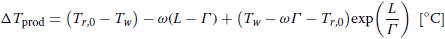

with _T_<i>r</i>,0 as the initial rock temperature at the bottom of the well (°C), _T_<i>w</i> as the geofluid temperature at the bottom of the well (°C), _ω_ as the average geothermal gradient (°C m−1), and _L_ as the depth of the reservoir (m), equal to the length of the well assuming vertical wells. The parameter _Γ_ is calculated assuming that the thermal resistances of the casing and cement are negligible:

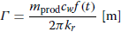

with _m_prod as the production wellbore flow rate (kg s−1) and _f_(_t_) as the time function for a line heat source given by:

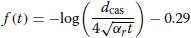

In this time function equation, _d_cas is the outer diameter of the casing (m). The time _t_ is the cumulative time that the well has been producing, i.e., by accounting for the utilization factor. Ramey’s model assumes the produced fluid is an incompressible, singlephase liquid with constant specific heat capacity. To calculate transient wellbore heat transmission for compressible or two-phase fluids, or to account for temperature and pressure dependency of fluid properties, a more advanced wellbore simulator should be implemented. To account for heat transmission in the injection wells, the user can specify a constant temperature gain. Ramey’s model has not been implemented for the injection wells because the built-in reservoir models (1 to 4) require a constant reservoir inlet temperature.

The injection and production well pumping power is estimated in GEOPHIRES by calculating the frictional and hydrostatic pressure drop in the well and the reservoir pressure drop. When the user opts to specify an overall reservoir impedance, the production and injection wells are assumed to be in hydraulic communication, the geofluid operates in a closed loop, and no flashing is allowed in the production wells or at the surface. In this case, the same approach for calculating the total pressure drop and pumping power is followed as in GEOPHIRES v1.0 (Beckers 2016<a href="#fn-4">[4]</a>). When specifying a productivity and injectivity index, the production and injection wells are treated individually following the same approach as GETEM (DOE 2016<a href="#fn-8">[8]</a>). The production wellhead pressure is provided by the user or set to 344.7 kPa (50 psi) above the water vapor pressure at production temperature (DOE 2016<a href="#fn-8">[8]</a>). When simulating a flash power plant, pumping of injection wells is considered but not of production wells, because the produced fluid is generally in two-phase flow. For ORC plants and direct-use heat applications, pumping of both injection and production wells is the default. Line-shaft pumps are considered for pumping of production wells with the necessary depth to prevent cavitation calculated by GEOPHIRES. A warning message is issued if this calculated depth is greater than 600 m.

GEOPHIRES calculates at each time step the frictional pressure drop in each well (Δ_P_well,fr) using the Darcy–Weisbach equation (Fox et al. 2004[^10]):

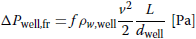

with _f_ as the Darcy friction factor (−), _ρ_<i>w</i>,well as the temperature-averaged density of the water in each well (kg m−3), _v_ as the average water velocity in the well (m s−1), and _d_well as the wellbore diameter (m). For turbulent flow, the Darcy friction factor is calculated using the Colebrook–White equation (Fox et al. 2004<a href="#fn-10">[10]</a>):

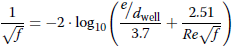

with _e_ as the wellbore pipe surface roughness (default set to 0.0001 m) and _Re_ as the Reynolds Number for flow in the wellbore ().

The hydrostatic pressure in each well Δ_P_well,hydro is calculated as follows:

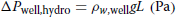

with _g_ as the gravitational acceleration (9.81 m s−2). The difference in water density between production and injection well can cause a significant buoyancy effect that offsets some of the required pumping power. The water temperature profile along the well due to wellbore heat transmission causes a density profile along the wellbore. However, simulations using Ramey’s model show that, after a few months of operation, the water temperature difference between top and bottom of each well is typically less than 10 °C resulting in a density difference of only a few percent. This justifies considering a temperature-averaged water density for each well.

The built-in Ramey and frictional pressure drop models assume that all wells are vertical and of equal depth. In addition, all injection and production wells are assumed to have the same injection and production wellbore diameter, and the same injection and production fluid flow rate, respectively. The code can easily be modified to account for deviated and horizontal wells, as well as different diameters, depths, and flow rates for different wells. In case of non-vertical wells, the user should specify for each well the total vertical depth (TVD) along with a measured depth (MD). The bottom-hole temperature and hydrostatic pressure is calculated based on the TVD; frictional pressure drop loses and wellbore costs are based on the MD. The Ramey model should be deactivated for non-vertical wells, because that model is only valid for vertical wellbore geometry. Instead, a constant production wellbore temperature drop can be specified by the user to capture production wellbore heat losses. In case of wells with different diameters, depths, and/or flow rates, the user should calculate the frictional pressure drop, hydrostatic pressure, wellbore heat transfer, and well cost for each well individually and store the results in arrays. Pumping requirements should be evaluated for each well individually. The average production temperature can be calculated by lumping together the produced fluid from each well. The total well cost is calculated by adding up the well cost for each well.

### Surface plant

If electricity is selected as the end-use product, then GEOPHIRES calculates the power production _P_ (MWe) by multiplying the utilization efficiency of the power plant _η_<i>u</i> with the exergy of the produced geothermal fluid _B_:

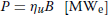

The exergy is calculated based on the specific enthalpy _h_ (J kg−1) and specific entropy _s_ (J kg−1 K−1) of the geothermal fluid at the production (prod) and ambient conditions (0):

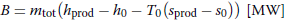

with _m_tot as the total mass flow rate produced (kg s−1) and _T_0 as the ambient temperature (K). GEOPHIRES has a built-in approximate correlation for calculating _B_ for pure water. Alternatively, steam tables or user-provided correlations can be used. Correlations for the utilization efficiency as a function of geothermal fluid production and ambient temperature were developed using power plant models in Aspen Plus and MATLAB for sub- and supercritical ORC and single- and double-flash power plants (Beckers 2016<a href="#fn-4">[4]</a>). The correlations are shown in Fig. 2 and have been implemented in GEOPHIRES. When selecting electricity or cogeneration as end-use, the user chooses as input one of these 4 power plant types. The ORCs are single-pressure, have air-cooled condensers, and a recuperator is included. No superheating is assumed in the subcritical cycle. Twenty-five refrigerants were evaluated and listed by Beckers (2016<a href="#fn-4">[4]</a>). The ORC correlations in Fig. 2 assume at each geofluid temperature, the refrigerant that maximizes the utilization efficiency is selected. For ambient temperatures different than 5 °C, 15 °C, or 25 °C, the utilization efficiency is linearly inter- or extrapolated. Explicit equations and a more detailed discussion on power plant specifications were provided by Beckers (2016<a href="#fn-4">[4]</a>). Correlations for the geothermal fluid temperature leaving the power plant were also developed and are incorporated in GEOPHIRES (Beckers 2016<a href="#fn-4">[4]</a>). These correlations are used in cogeneration mode with a topping cycle to estimate the geothermal fluid temperature available for a direct-use heat application. GEOPHIRES does not consider scaling (or mineral precipitation); however, scaling may put constraints on plant operating conditions, especially for hydrothermal reservoirs. For example, scaling of silica, caused by a decrease in geothermal fluid temperature, may put a lower limit on the injection temperature or require installing a chemical scale inhibitor system.

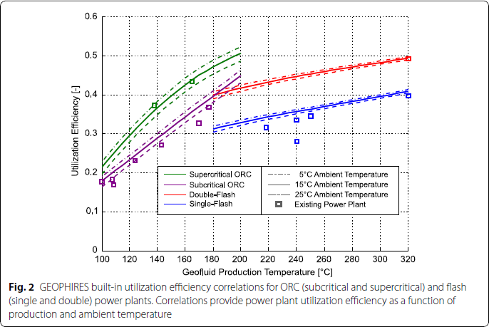

Various geothermal direct-use heat applications are possible, e.g., space and water heating, greenhouses, aquaculture, and industrial heat uses. GEOPHIRES does not have built-in correlations for these various applications to estimate plant performance and re-injection temperature as a function of production temperature, time of the day and year, etc. Rather, GEOPHIRES allows users to specify a utilization factor and thermal efficiency factor of the direct-use heat application, suitable for simple calculations. For more advanced representation of the surface plant, users are encouraged to implement their own correlations obtained, for example, from direct measurements or advanced process modeling simulations.

### Cost correlations (capital and O&M)

The method in GEOPHIRES to estimate capital cost is based on the following: (1) capital cost consists of costs for exploration, drilling, surface plant, field gathering system, and reservoir stimulation, (2) built-in cost correlations incorporate indirect costs and contingency, (3) cost of financing is accounted for by the levelized cost model, and (4) capital cost escalation and debt on interest during construction is captured by a lumped capital cost multiplier. This method is similar to the method applied in the 2006 Future of Geothermal Energy Report (Tester et al. 2006[^11]) and the 1990 Heat Mining Report (Tester and Herzog 1990[^12]). The capital cost (_C_cap) is calculated as follows:

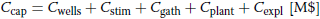

with _C_wells, _C_stim, _C_gath, _C_plant, and _C_expl as the total well cost, reservoir stimulation cost, field gathering system cost, surface plant cost, and exploration cost, respectively. GEOPHIRES has built-in correlations for each of these capital cost terms. Users can use these correlations directly, multiply them by a factor, or provide their own cost figures. The built-in capital cost correlations are as follows:

* The total well cost (_C_wells) is calculated as the cost per well multiplied by the userprovided number of production and injection wells. GEOPHIRES considers all wells to have the same depth; however, this assumption can easily be modified to account for various well depths. Four correlations are implemented to estimate the drilling and completion cost per well based on the work by Lowry et al. (2017[^13]). These correlations include 15% contingency and 5% for indirect costs (project management and engineering costs) (DOE 2016<a href="#fn-8">[8]</a>). These correlations are for small well diameter (0.16 m casing inner diameter) vs. large well diameter (0.22 m casing inner diameter), and vertical and open-hole vs. horizontal and with liner. They are plotted in Fig. 3. Correlation 4 falls within 10% of both the large diameter well cost correlation implemented in GETEM (DOE 2016<a href="#fn-8">[8]</a>) and the geothermal well cost correlation developed by Lukawski et al. (2014[^14]). Correlation 2 follows closely (within 10%) the small diameter well cost correlation in GETEM. GEOPHIRES assumes as default a 100% well drilling success rate, which may overstate actual field drilling success rates. Sanyal and Morrow (2012[^15]) found an average success rate of 71%, based on drilling and production data in 52 geothermal fields. GETEM assumes as default a 75% drilling success rate for hydrothermal development wells and 90% drilling success rate for EGS development wells. To account for failed wells in GEOPHIRES, the user can assign a drilling cost multiplier (e.g., a multiplier of 2 for a 50% drilling success rate).

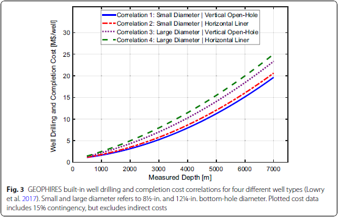

* The built-in cost correlation for stimulating EGS-type reservoirs (_C_stim) is $1.25 M per injection well (Beckers and Young 2017[^16]) plus 15% contingency and 5% for indirect costs (DOE 2016<a href="#fn-8">[8]</a>). For traditional hydrothermal reservoirs, this cost parameter is set to $0.
* The built-in cost correlation for estimating the field gathering system cost (_C_gath) follows the same approach as GETEM (DOE 2016<a href="#fn-8">[8]</a>). _C_gath includes the cost for surface piping from each well to the plant and pumps for production and injection wells. The length of the surface piping is assumed 750 m per well at a cost of $500 per meter (DOE 2016<a href="#fn-8">[8]</a>). The pumping cost for each pump in the production wells (line-shaft pumps) and a single pump for the injection wells is calculated with the same correlation as GETEM (DOE 2016<a href="#fn-8">[8]</a>). An additional 15% is added for contingency and 12% for indirect costs (DOE 2016<a href="#fn-8">[8]</a>). _C_gath does not include the cost of pipelines to an off-site heat user or a district-heating system. These costs are estimated at $750 per meter pipeline length (Beckers and Young 2017<a href="#fn-16">[16]</a>) and can be manually added by the user to the pipeline distribution costs.
* The built-in power plant cost correlations (_C_plant) are based on the original correlations developed by Beckers (2016<a href="#fn-4">[4]</a>), indexed to 2017 using the IHS Markit North American Power Capital Costs Index (NAPCCI) excluding nuclear plants (IHS 2018[^17]). The ORC power plant cost data have been updated with data from the 2016 GETEM tool (DOE 2016<a href="#fn-8">[8]</a>) and the geothermal binary power plants study by Verkís (2014[^18]). Figure 4 shows the power plant capital cost expressed in $ kWe−1 as a function of plant size and initial production temperature for subcritical ORC and double-flash power plants. The correlations in GEOPHIRES include 12% for indirect costs and 15% contingency. For the same plant size and production temperature, double-flash power plants are considered about 25% more expensive than single-flash power plants (Zeyghami 2010[^19]), and supercritical ORC plants are roughly 10% more than subcritical ORC plants (Astolfi et al. 2014[^20]). A wide range in power plant specific cost values is reported in academic and popular literature. The GEOPHIRES built-in surface plant cost correlations represent typical values. However, the user is recommended to provide their own power plant cost data if available for their case study. The ORC plant specific cost decreases only moderately at higher temperatures. The reasons are that when increasing the temperature, the ORC plant design also changes: (1) a different organic fluid is selected, (2) piping, pump, heat exchangers, and other equipment are designed to handle the higher temperature (and potentially also pressure), requiring thicker walls, potentially different materials, etc., and (3) additional components may be implemented, such as a heat recuperator, making the design and operation more complex. Unlike flash power plants, ORC plants are a small, niche market, typically case specific, and rely on relatively young technology, which has not been subject yet to decades of technological advancement. The cost for direct-use heat applications is highly dependent on the type of application. A generic cost of $250 kWth−1 plus 15% contingency and 12% indirect costs is assumed in GEOPHIRES. However, users are encouraged to provide their own cost figures for their specific application. Beckers and Young (2017<a href="#fn-16">[16]</a>) collected several cost figures to estimate the surface equipment cost for geothermal district-heating systems.

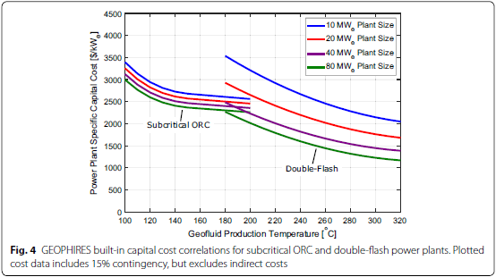

* The built-in exploration cost correlation (_C_expl) considers drilling of a slim-hole well at 60% of the cost of a regular well, $1 M for geophysical and field work, an additional 12% on the total cost for technical and office support (indirect costs) and 15% for contingency (Beckers 2016<a href="#fn-4">[4]</a>).

This capital cost method is comparable to the method in GETEM with a few simplifications. GETEM considers a more detailed exploration, development and construction scheme where capital costs can be distributed over different years, and different discount rates can be assigned to different years. In GEOPHIRES, we consider the capital costs occur overnight and a lumped capital cost multiplier is available to capture effects such as capital cost escalation and debt on interest during construction. Further, unlike GETEM, GEOPHIRES does not consider capital costs for leasing, permitting and transmission lines. However, they could be manually added by the user as an additional capital cost term. While GEOPHIRES v1.0 only considered 15% contingency on drilling costs, all capital cost terms in GEOPHIRES v2.0 now consider 15% to align with more standard practices (as in GETEM). Similar to GETEM, no process contingency is considered in GEOPHIRES v2.0. However, if deemed applicable to a project, the user can manually account for process contingency by assigning a multiplier to the capital cost correlations (e.g., 1.2 for 20% process contingency).

GEOPHIRES estimates the annual O&M costs _C_O&M (in M$ year−1) as follows:

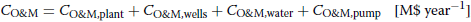

with _C_O&M,plant, _C_O&M,wells, _C_O&M,water, and _C_O&M,pump as the annual surface plant, wellfield, make-up water, and pumping O&M costs.

* GEOPHIRES estimates the annual surface plant O&M costs (_C_O&M,plant) as the sum of 1.5% of the total plant capital cost (for annual non-labor costs), and 75% of the annual labor costs, which is an approach similar to GETEM and GEOPHIRES v1.0 (Beckers 2016<a href="#fn-4">[4]</a>). The other 25% of the labor costs are assigned to the wellfield O&M cost. The labor costs are calculated internally in GEOPHIRES using the 2014 labor costs provided by Beckers (2016<a href="#fn-4">[4]</a>), indexed to 2017 using the Bureau of Labor Statistics (BLS) Employment Cost Index for utilities (BLS 2018[^21]). The original 2014 labor cost correlation expresses the labor costs as M$ year−1 as a function of the plant size (MW) using an approximate logarithmic curve fit to the built-in labor cost data in GETEM (Beckers 2016<a href="#fn-4">[4]</a>).
* The built-in correlation for the wellfield O&M costs (_C_O&M,wells) is similar as the surface plant O&M costs: it assumes that _C_O&M,wells consists of 1% of the total well plus field gathering system costs (for annual non-labor costs) and 25% of the labor costs (the other 75% of the labor cost were assigned to the surface plant O&M cost).
* To account for loss of water in the reservoir (especially in the case of EGS-type reservoirs), the user can provide a water loss rate. GEOPHIRES estimates the annual costs to buy make-up water (_C_O&M,water) using a water price of $3.5/1000 gallons.
* If the end-use option is direct-use heat only, then electricity is purchased at a userprovided electricity rate to power the geothermal fluid circulation pumps (_C_O&M,pump). In the case of electricity-only or cogeneration mode, the pumping power is considered auxiliary power and subtracted from the gross electricity generation.

### Levelized cost models

GEOPHIRES v2.0 has five built-in models to calculate the levelized cost of energy: (1) the Fixed Charge Rate (FCR) model, (2) the Standard Levelized Cost model, (3) the BICYCLE model, (4) Closed-Loop Geothermal System (CLGS, also known as Advanced Geothermal System - AGS), and (5) System Advisor Model (SAM) Single-owner Power Purchase Agreement (PPA). If the user selects electricity or cogeneration with electricity as the main product, then GEOPHIRES calculates the LCOE in units of ¢ kWh−1. In the case of direct-use heat or cogeneration with direct-use heat as the main product, then GEOPHIRES calculates the LCOH in units of $ MMBtu−1 (MMBtu = million Btu). The code can easily be modified to present the results in other units or to calculate other metrics such as NPV, IRR and payback period. However, these metrics, unit conversions, and necessary code modifications are not discussed in this paper.

The FCR model is the simplest levelized cost model, with the LCOE or LCOH calculated by (Armstead and Tester 1987<a href="#fn-5">[5]</a>):

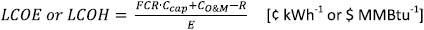

with _C_cap as the total upfront capital investment (M$) and _C_O&M as the average annual O&M cost (M$ year−1; including cost for pumping power in direct-use heat mode). The parameter _R_ is used in the CHP mode and represents the average annual income from the secondary product (M$ year−1), e.g., if electricity is the main product, then the levelized cost is calculated in LCOE, and _R_ is the secondary revenue from selling heat. The parameter _E_ is the average annual net amount of electricity or heat produced (kWh or MMBtu). The FCR is a user-provided parameter and represents the fraction of total capital cost that must be paid each year (i.e., annuity) to pay off the total investment. It is based on the uniform capital recovery factor (UCRF), which depends on lifetime and discount rate, and tax rates, tax credits, insurance costs, depreciation, etc. (Short et al. 1995[^22]). Either a nominal levelized cost (current dollar analysis) or real levelized cost (constant dollar or “price year” dollar analysis) is calculated depending on whether the UCRF is based on a nominal or real discount rate (Short et al. 1995<a href="#fn-22">[22]</a>). Real discount rates exclude inflation whereas nominal discount rates include inflation.

The Standard Levelized Cost model discounts future revenue and expenditures to today’s dollars and calculates the levelized cost using the following equation (OECD/IEA 2015[^23]):

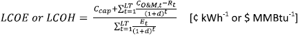

with _d_ as the real discount rate (−), LT as the plant lifetime (years), and _C_O&M,<i>t</i>, _E_t, and _R_<i>t</i> as the O&M cost (M$ year−1), energy production (kWh or MMBtu), and secondary CHP revenue stream (M$ year−1), in year _t_, respectively. In Eq. (24), _C_O&M,<i>t</i> and _R_<i>t</i> are not corrected for inflation; therefore, _d_ is the real discount rate, and the levelized cost is calculated in constant dollars (Short et al. 1995<a href="#fn-22">[22]</a>). Alternatively, with a nominal discount rate in the denominator, the levelized cost is calculated in current dollars and accounts for inflation (Short et al. 1995<a href="#fn-22">[22]</a>). No taxes are considered in this levelized cost model.

The BICYCLE Levelized Life Cycle Cost model was developed at Los Alamos National Laboratory (Hardie 1981[^24]) and is the most detailed built-in levelized cost model in GEOPHIRES. It allows for accounting for variable debt/equity return rates, various tax rates (i.e., income, revenue, and property), and an investment tax credit (a tax credit as a percentage of the capital cost that is deducted from the income tax liability in the first year). All BICYCLE model equations implemented in GEOPHIRES were presented by Beckers (2016<a href="#fn-4">[4]</a>). The built-in version of the BICYCLE model requires as input the inflation rate and nominal discount rates (on equity and debt), and returns as output the real levelized cost in 2017 constant dollars. The BICYCLE model assumes linear depreciation of the invested capital over the plant lifetime with no salvage value.

For information on the other two models, see the documentation for the relevant module below:
* [CLGS](https://nrel.github.io/GEOPHIRES-X/reference/geophires_x.html#module-geophires_x.AGSEconomics)
* [SAM Single-owner PPA](https://nrel.github.io/GEOPHIRES-X/SAM-Economic-Models.html)

All built-in cost correlations were either developed for 2017 constant dollars ($2017) or indexed from a previous year to $2017; therefore, the levelized cost results have the year 2017 as base year. Unlike for example GETEM, no cost index curves (e.g., for labor, wells, pumps, etc.) have been built-into convert the results into a different year. However, the user can either manually enter costs for a different year or implement their cost index correlations directly into the GEOPHIRES code.

### Time stepping

GEOPHIRES assumes linear time discretization with a user-provided number of time steps per year over the lifetime of the plant. The default is four time steps per year, meaning a time step of 3 months. At every time step, GEOPHIRES calculates the reservoir output temperature, production wellhead temperature, direct-use heat and/or electricity power output (in MW), pressure drops and pumping power. On an annual basis, GEOPHIRES calculates the O&M costs and direct-use heat and/or electricity production (in GWh year−1). To investigate seasonal effects, e.g., to assess the impact of more geothermal heat demand for district heating in winter than in summer, the user can select a smaller time step, e.g., a month (or 12 time steps per year). For even shorter timescale effects, e.g., to account for an hourly varying ambient temperature or investigate the response in plant operation to a fluctuating revenue rate), the user can select an even smaller time step, e.g., 1 h (or 8760 time steps per year).

## Example simulations

Two example simulations are included to provide validation for the tool and give new and prospective users a sense of which input parameters are needed, what level of detail is considered, and what type of output results are calculated.

The first example case study (see Table 1) considers a generic industrial direct-use heat application operating at relative high utilization factors (90%) using heat extracted from a sedimentary matrix-permeable geothermal reservoir at 2000 m depth and initial temperature of 120 °C. With a surface temperature of 15 °C, this reservoir depth and temperature corresponds to an average geothermal gradient of 52.5 °C. The well configuration is a doublet system with one vertical injection and one vertical production well. The geofluid is assumed to be pure water and is re-injected at a constant temperature of 80 °C. Typical reservoir dimensions and geological and physical properties are considered. No reservoir stimulation is applied. The coupled reservoir simulator TOUGH2 simulates the transient reservoir output temperature. Production wellbore heat losses are estimated using the built-in Ramey’s model. Pumping requirements are estimated by assuming a typical productivity and injectivity index of 5 kg s−1 bar−1. The LCOH is estimated with the BICYCLE model. A surface plant total capital cost of $5 M is specified for surface plant equipment direct cost (e.g., cost of heat exchanger and plant building) and project indirect cost (engineering and procurement). All other capital and O&M costs are calculated using the built-in correlations. Other economic input parameters (i.e., project lifetime, inflation rate, interest rates, bond/equity financing fraction, tax rates, and pumping power electricity rate) are based on previous case studies conducted by Tester et al. (2006<a href="#fn-11">[11]</a>) and Beckers (2016<a href="#fn-4">[4]</a>), as well as parameters used in the Geothermal Vision Study (Beckers and Young 2017<a href="#fn-16">[16]</a>).

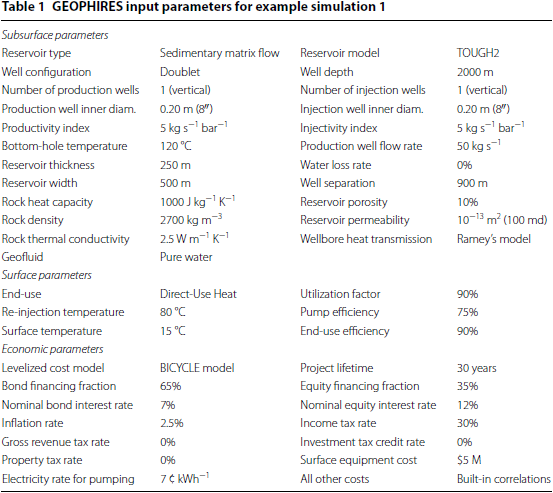

The simulated reservoir output and wellhead production temperatures, and the constant wellhead injection temperature over the lifetime of the plant are plotted in Fig. 6. Various calculated output results are listed in Table 2. The doublet system has an average heat production of 7.2 MWth, which falls in the range of typical values for installed capacity of geothermal direct-use heat systems. For example, the average installed capacity values for geothermal district-heating facilities are about 5 MWth in the United States (Snyder et al. 2017b[^25]) and about 18 MWth in Europe (EGEC 2016[^26]). Validating the LCOH is more complicated because the levelized cost of a direct-use heat site depends heavily on the type of end-use application, the amount of surface infrastructure necessary, and the economic parameters (such as discount rate) assumed. For example, a residential district-heating system requiring a large surface piping network and only operating for 50% of the time (i.e., winter) would have a significantly higher LCOH than a single industrial plant located near the wellhead using the heat year-round. Nevertheless, rough comparisons can be drawn. The calculated LCOH of ¢3.2 kWhth−1 (or $32 MWhth−1) falls on the lower end of the range of estimated LCOH values for geothermal district-heating systems in the USA ($30 to $120 MWhth−1; Thorsteinsson and Tester 2010[^27]) and Europe ($21 to $85 MWhth−1 with average of $64 MWhth−1; Dumas and Angelino 2015[^28]). This is expected because a surface piping network (which is not considered in this example simulation) increases the LCOH by roughly 10% to 40% (Reber 2013[^29]). Lower utilization factors for district heating (compared to the 90% in this example) would also increase the LCOH. A more comparable analysis was done with GEOPHIRES v1.0 by Beckers (2016<a href="#fn-4">[4]</a>), who estimated the LCOH for EGS industrial direct-use heat applications in the range of $14 to $28 MWhth−1, depending on the technology level assumed. The LCOH in this example is on the high end of this range, as expected, because Beckers (2016<a href="#fn-4">[4]</a>) assumed a lower re-injection temperature of 50 °C (vs. 80 °C), a lower discount rate of 7% (vs. 8.8%), and a lower surface plant equipment cost of $150 kWth−1 (vs. $625 kWth−1).

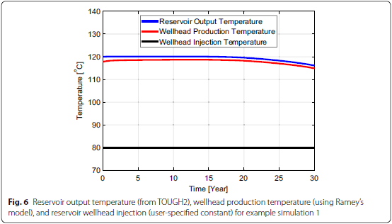

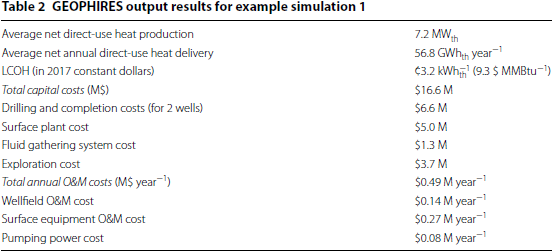

Example simulation 2 represents a hydrothermal reservoir at 175 °C and 2000 m depth, coupled to an ORC power plant for electricity generation. The thermal drawdown is linear at a rate of 0.5% year−1 (Snyder et al. 2017a<a href="#fn-6">[6]</a>). No seasonal ambient temperature changes are considered. The productivity and injectivity index are assumed constant at 5 kg s−1 bar−1. The built-in cost correlations are applied for estimating all capital and O&M costs. The LCOE is calculated using the FCR model with 10.8% discount rate. All input parameters are listed in Table 3.

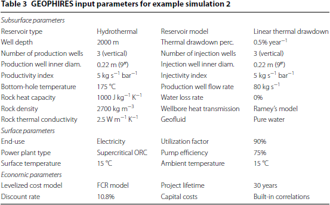

Main GEOPHIRES simulation results are presented in Table 4. Because of a small wellfield (only three production and three injection wells), the power plant output is rather small (average net electricity production of only 12.4 MWe). Comparing with LCOE values reported in literature is not trivial, because different studies consider different depths, temperatures, plant sizes and types, discount rates, etc. The GEOPHIRES calculated LCOE of ¢11.6 kWh−1 falls in the range of reported LCOE values for hydrothermal systems (3 to ¢14 kWh−1) in the 2017 transparent cost database (OpenEI 2017[^30]). The 2015 Projected Costs of Generating Electricity report (OECD/IEA 2015<a href="#fn-23">[23]</a>) states an average LCOE of ¢12 kWh−1 for low-temperature binary cycle geothermal plants in the US Modeling a similar geothermal system with GETEM (hydrothermal reservoir at 2000 m depth and 175 °C coupled to an ORC power plant; 3 production and 3 injection wells with 80 kg s−1 flow rate; 10.8% FCR; 100% drilling success rate; permitting, leasing, royalties, and transmission lines omitted;) results in an LCOE of ¢10.8 kwh−1, capital cost of $78.8 M, annual O&M cost of $2.5 M year−1 and average net power production of 11.6 MWe. These results are comparable to the GEOPHIRES output results.

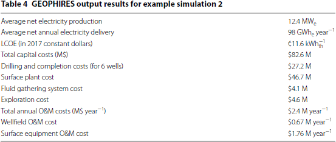

Other case studies providing additional validation by comparing GEOPHIRES output with GETEM results and published levelized cost values were provided by Beckers et al. (2013[^31]) and Beckers (2016<a href="#fn-4">[4]</a>) for GEOPHIRES v1.0 and Beckers and McCabe (2018[^32]) for GEOPHIRES v2.0.

## Abbreviations

| Abbreviation | Definition                                                                      |
|:------------:|---------------------------------------------------------------------------------|
| CHP          | combined heat and power                                                         |
| DOE          | Department of Energy                                                            |
| EGS          | enhanced geothermal system                                                      |
| FCR          | fixed charge rate                                                               |
| GEOPHIRES    | Geothermal Energy for Production of Heat and Electricity Economically Simulated |
| GETEM        | Geothermal Energy Technology Evaluation Model                                   |
| IRR          | internal rate of return                                                         |
| LBNL         | Lawrence Berkeley National Laboratory                                           |
| LCOE         | levelized cost of electricity                                                   |
| LCOH         | levelized cost of heat                                                          |
| MD           | measured depth                                                                  |
| NAPCCI       | North American Power Capital Costs Index                                        |
| NPV          | net present value                                                               |
| NREL         | National Renewable Energy Laboratory                                            |
| NTU          | Number of Transfer Units                                                        |
| O&M          | operation and maintenance                                                       |
| ORC          | organic Rankine cycle                                                           |
| TOUGH2       | Transport Of Unsaturated Groundwater and Heat v2                                |
| TVD          | total vertical depth                                                            |
| UCRF         | uniform capital recovery factor                                                 |

### Symbols

| Symbol                                        | Units                            | Definition                                                                      |
|:---------------------------------------------:|:--------------------------------:|---------------------------------------------------------------------------------|
| _B_                                           | MW                               | geofluid energy                                                                 |
| _Bi_                                          | –                                | Biot number in 1-Dimensional Linear Heat Sweep model                            |
| _c_                                           | J kg−1 K−1 | specific heat capacity                                                          |
| _C_                                           | US $M                            | cost                                                                            |
| _d_                                           | m                                | diameter                                                                        |
| _d_                                           | –                                | real discount rate                                                              |
| _e_                                           | m                                | wellbore pipe surface roughness                                                 |
| _E_                                           | kWh                              | electricity produced                                                            |
| _E_                                           | MMBtu                            | heat produced                                                                   |
| _f_                                           | –                                | time function in Ramey’s model or Darcy friction factor                         |
| FCR                                           | –                                | fixed charge rate                                                               |
| _g_                                           | 9.81 m s−2            | gravitational acceleration                                                      |
| _h_                                           | W m−2 K−1  | rock surface heat transfer coefficient in 1-Dimensional Linear Heat Sweep model |
| _h_                                           | J kg−1                | specific enthalpy                                                               |
| _H_                                           | m                                | fracture height                                                                 |
| _k_                                           | W m−1 K−1  | thermal conductivity                                                            |
| _L_                                           | m                                | reservoir depth                                                                 |
| LCOE                                          | US ¢ kWh−1            | levelized cost of electricity                                                   |
| LCOH                                          | US $ MMBtu−1          | levelized cost of heat                                                          |
| LT                                            | years                            | plant lifetime                                                                  |
| _m_                                           | kg s−1                | mass flow rate                                                                  |
| _m/A_                                         | kg s−1 m−2 | mass loading parameter in _m/A_ Thermal Drawdown Parameter Model                |
| _p_                                           | year−1                | percentage thermal drawdown in percentage temperature drawdown model            |
| _P_                                           | MWe                   | power plant electricity production                                              |
| _Q_                                           | m2 s−1     | volumetric flow rate per fracture per unit depth of the fracture                |
| _r_                                           | m                                | radius                                                                          |
| _R_                                           | US M$ year−1          | average annual secondary revenue stream in cogeneration mode                    |
| _Re_                                          | m                                | Reynolds number                                                                 |
| _s_                                           | s−1                   | Laplace variable                                                                |
| _s_                                           | J kg−1 K−1 | specific entropy                                                                |
| _t_                                           | s or year                        | time                                                                            |
| _T_                                           | °C or K                          | temperature                                                                     |
|  | °C                               | temperature in Laplace domain                                                   |
| _v_                                           | m s−1                 | average water velocity in well                                                  |
| _V_                                           | m3                    | mean volume of rock block in 1-Dimensional Linear Heat Sweep Model              |
| _x_                                           | m                                | half-width fracture separation                                                  |
| ¢                                             | –                                | US cent                                                                         |
| $                                             | –                                | US dollar                                                                       |
| _α_                                           | m2 s−1     | thermal diffusivity                                                             |
| _γ_                                           | –                                | heat storage ratio parameter in 1-Dimensional Linear Heat Sweep Model           |
| _Γ_                                           | m                                | parameter in Ramey’s model                                                      |
| Δ_T_                                          | °C                               | temperature drop                                                                |
| Δ_P_                                          | Pa                               | pressure drop                                                                   |
| _η_                                           | –                                | efficiency                                                                      |
| _ρ_                                           | kg m−3                | density                                                                         |
| _τ_                                           | s                                | time constant                                                                   |
| _φ_                                           | –                                | rock porosity                                                                   |
| _ω_                                           | °C m−1                | average geothermal gradient                                                     |

### Subscripts

| Subscript | Definition                                   |
|:---------:|----------------------------------------------|
| 0         | initial or ambient                           |
| cap       | capital                                      |
| D         | dimensionless                                |
| ef        | effective                                    |
| expl      | exploration                                  |
| fr        | friction                                     |
| gath      | field fluid gathering system                 |
| hydro     | hydrostatic                                  |
| inlet     | reservoir inlet                              |
| O&M       | operation and maintenance                    |
| plant     | surface plant                                |
| prod      | production conditions or production wellbore |
| pump      | geofluid circulating pumping                 |
| _r_       | rock                                         |
| _R_       | reservoir                                    |
| res       | residence                                    |
| stim      | reservoir stimulation                        |
| _t_       | year t                                       |
| tot       | total                                        |
| _u_       | utilization                                  |
| _w_       | water                                        |
| water     | make-up water                                |
| well      | wellbore                                     |

## References

[^1]: Gringarten AC, Witherspoon PA, Ohnishi Y. Theory of heat extraction from fractured hot dry rock. J Geophys Res. 1975;80(8):1120–4.
[^2]: Johansson F. mpmath: a Python library for arbitrary-precision floating-point arithmetic (version 1.0.0). [http://mpmath.org/](http://mpmath.org/). 2017.
[^3]: Hunsbedt A, Lam S T-F, Kruger P. User’s Manual for the One-Dimensional Linear Heat Sweep Model. Stanford Geothermal Program, Interdisciplinary Research in Engineering and Earth Sciences, Stanford University, Stanford, California, United States, SGP-TR-75. 1984.
[^4]: Beckers KF (2016) Low-temperature geothermal energy: systems modeling, reservoir simulation, and economic analysis, Ph.D. Dissertation, Cornell University, Ithaca, New York, United States.
[^5]: Armstead HCH, Tester JW. Heat mining. London: E. & F.N. Spon Ltd.; 1987.
[^6]: Snyder DM, Beckers KF, Young KR, Johnston B. Analysis of geothermal reservoir and well operational conditions using monthly production reports from Nevada and California. Trans Geotherm Resour Council. 2017a;41:2844–56.
[^7]: Pruess K, Oldenburg CM, Moridis GJ. TOUGH2 user’s guide version 2. No. LBNL—43134. Lawrence Berkeley National Laboratory, Berkeley, California, United States. 1999.
[^8]: DOE. Geothermal Electricity Technology Evaluation Model (GETEM) United States Department of Energy (DOE) [https://energy.gov/eere/geothermal/geothermal-electricity-technology-evaluation-model](https://energy.gov/eere/geothermal/geothermal-electricity-technology-evaluation-model). 2016.
[^9]: Ramey HJ Jr. Wellbore heat transmission. J Petrol Technol. 1962;14(04):427–35.
[^10]: Fox RW, Pritchard PJ, McDonald AT. Introduction to fluid mechanics. 6th ed. New York: Wiley; 2004.
[^11]: Tester JW, Anderson B, Batchelor A, Blackwell D, DiPippo R, Drake E, Garnish J, Livesay B, Moore MC, Nichols K, Petty S, Toksz MN, Veatch Jr RW. The future of geothermal energy: impact of Enhanced Geothermal Systems (EGS) on the United States in the 21st Century. Massachusetts Institute of Technology, DOE contract DE-AC07-05ID14517 Final Report. 2006.
[^12]: Tester JW, Herzog HJ. Economic predictions for heat mining: a review and analysis of hot dry rock (HDR) geothermal energy technology, Massachusetts Institute of Technology Energy Laboratory Report MIT-EL 90-001. U.S. Department of Energy, Geothermal Technology Division. 1990.
[^13]: Lowry TS, Finger JT, Carrigan CR, Foris A, Kennedy MB, Corbett TF, Doughty CA, Pye S, Sonnenthal EL. Reservoir maintenance and development task report for the DOE geothermal technologies office GeoVision study, Sandia report SAND2017-9977. 2017.
[^14]: Lukawski MZ, Anderson BJ, Augustine C, Capuano LE Jr, Beckers KF, Livesay B, Tester JW. Cost analysis of oil, gas, and geothermal well drilling. J Petrol Sci Eng. 2014;118:1–14.
[^15]: Sanyal SK, Morrow JW. Success and the learning curve effect in geothermal well drilling—a worldwide survey. In: Proceedings, thirty-seventh workshop on geothermal reservoir engineering, Stanford University, Stanford, California, January 30–February 1, 2012, SGP-TR-194. 2012.
[^16]: Beckers KF, Young KR. Performance, cost, and financial parameters of geothermal district heating systems for market penetration modeling under various scenarios. In: Proceedings, 42nd workshop on geothermal reservoir engineering, Stanford University, Stanford, California, February 13–15, 2017, SGP-TR-212. 2017.
[^17]: IHS. IHS Markit North American Power Capital Costs Index (NAPCCI). [https://ihsmarkit.com/Info/cera/ihsindexes/index.html](https://ihsmarkit.com/Info/cera/ihsindexes/index.html). 2018.
[^18]: Verkís. Geothermal binary power plants. Preliminary study of low temperature utilization, cost estimates and energy cost. 2014.
[^19]: Zeyghami M. Thermoeconomic optimization of geothermal flash steam power plants. In: Proceedings, World Geothermal Congress, Bali, Indonesia. 2010.
[^20]: Astolfi M, Romano MC, Bombarda P, Macchi E. Binary ORC (Organic Rankine Cycles) power plants for the exploitation of medium-low temperature geothermal sources-part B: techno-economic optimization. Energy. 2014;66:435–46.
[^21]: BLS. Employment Cost Index, Bureau of Labor Statistics. [https://www.bls.gov/ncs/ect/](https://www.bls.gov/ncs/ect/). 2018.
[^22]: Short W, Packey DJ, Holt T. A manual for the economic evaluation of energy efficiency and renewable energy technologies (No. NREL/TP–462-5173). National Renewable Energy Laboratory (NREL), Golden, Colorado, United States. 1995.
[^23]: OECD/IEA. Projected costs of generating electricity: 2015 Edition. OECD NEA/IEA, Organisation for Economic Co-operation and Development Nuclear Energy Agency/International Energy Agency; 2015.
[^24]: Hardie RW. BICYCLE II: a computer code for calculating levelized life-cycle costs, LA-89089. Los Alamos: Los Alamos National Laboratory; 1981.
[^25]: Snyder DM, Beckers KF, Young KR. Update on geothermal direct-use installations in the U.S. In: Proceedings, 42nd workshop on geothermal reservoir engineering, Stanford University, Stanford, California, February 13–15, 2017, SGP-TR-212. 2017b.
[^26]: EGEC. Market Report 2015. European Geothermal Energy Council. 5th edition, 2016.
[^27]: Thorsteinsson HH, Tester JW. Barriers and enablers to geothermal district heating system development in the United States. Energy Policy. 2010;38(2):803–13.
[^28]: Dumas P, Angelino L. GeoDH: promote geothermal district heating systems in Europe. In: Proceedings, World Geothermal Congress 2015, Melbourne, Australia, 19–25 April 2015.
[^29]: Reber TJ. Evaluating opportunities for enhanced geothermal system-based district heating in New York and Pennsylvania. MS thesis, Cornell University, Ithaca, New York, United States. 2013.
[^30]: OpenEI. Transparent Cost Database. Developed and maintained by National Renewable Energy Laboratory (NREL). [https://openei.org/apps/TCDB/transparent_cost_database](https://openei.org/apps/TCDB/transparent_cost_database). 2017.
[^31]: Beckers KF, Lukawski MZ, Reber TJ, Anderson BJ, Moore MC, Tester JW. Introducing Geophires v1.0: Software package for estimating levelized cost of electricity and/or heat from enhanced geothermal systems. In: Proceedings, 38th workshop on geothermal reservoir engineering, Stanford University, Stanford, California, February 11–13, 2013, SGP-TR-198.
[^32]: Beckers KF, McCabe K. Introducing GEOPHIRES v2.0: updated geothermal techno-economic simulation tool. In: Proceedings, 43rd workshop on geothermal reservoir engineering, Stanford University, Stanford, California, February 12–14, 2018, SGP-TR-213. 2018.
