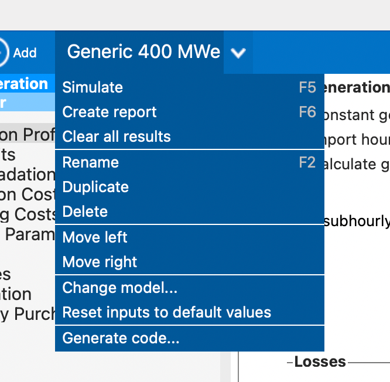

# About

This is a utility module used to generate config/metadata for SAM economics (not part of GEOPHIRES runtime)

# Generate Baseline PySAM JSON

1. Open `Generic_400_MWe.sam` in SAM
2. Select Generic 400 MWe case tab -> Generate code... -> select `src/geophires_x/sam_economics/Generic_400_MWe`
   directory -> OK 

# SAM Module docs

Sources:

1. `Cashloan.html.txt`: https://nrel-pysam.readthedocs.io/en/main/modules/Cashloan.html
1. `Singleowner.html.txt`: https://nrel-pysam.readthedocs.io/en/main/modules/Singleowner.html

To update sources, visit links, manually select relevant text from page, and copy-paste into corresponding `.html.txt`
file.

Instructions: Run `geophires_sam_economics/main.py` and copy-paste the relevant output in
`geophires_x/sam_economics/sam-output-properties.json`
